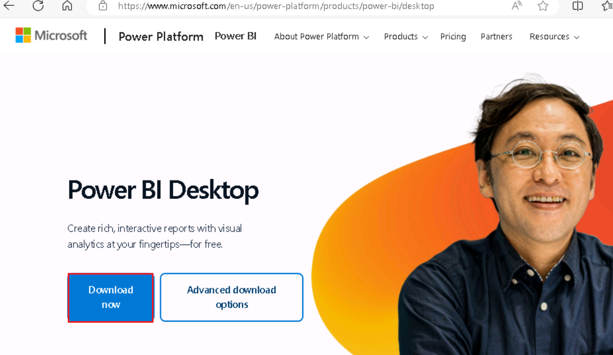
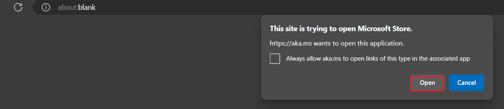
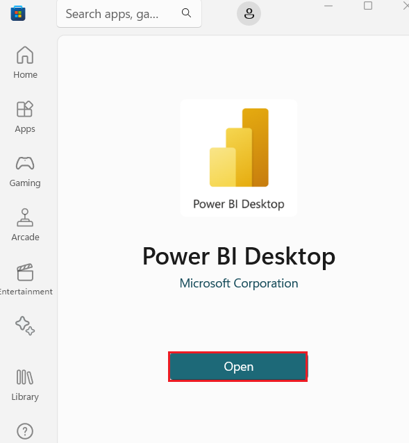

**Use Case 01 – Build SQL database in Microsoft Fabric to query, report,
and share the data**

**Introduction**

This use case provides a hands-on lab experience for building and
managing a SQL database within **Microsoft Fabric**, a unified data
platform. It is designed for users who want to explore the capabilities
of Microsoft Fabric for data storage, querying, reporting, and sharing.
The lab walks through the complete lifecycle of a SQL database—from
environment setup and data import to advanced analytics and API
creation—using the AdventureWorks sample dataset. It emphasizes
practical application through step-by-step exercises that simulate
real-world data scenarios.

**Objectives**

- Set up a Microsoft Fabric trial environment and create a new
  workspace.

- Enable and configure SQL database capabilities within Fabric.

- Create and manage a SQL database using the Fabric portal.

- Load and explore sample data (AdventureWorksLT) in the SQL database.

- Write and execute T-SQL queries to create and manipulate database
  objects.

- Query data using the SQL Analytics Endpoint and understand OneLake
  integration.

- Generate and test a GraphQL API from the SQL database.

- Build and publish interactive reports using Power BI connected to the
  Fabric SQL database.

- Share data securely and manage user access and roles within the Fabric
  environment.

- Clean up resources after completing the lab.

## Exercise 1 – Set up your environment

### **Task-1: Sign-In to Microsoft Fabric**

1.  Open your browser and browse the **Microsoft Fabric**
    +++https://app.fabric.microsoft.com/+++

2.  In the **Microsoft Fabric** window, enter your given credentials,
    and click on the **Submit** button. 

    

3.  Then, In the **Microsoft** window, enter the password and click on
    the **Sign in** button 

    

4.  In **Stay signed in?** window, click on the **Yes** button.

    

5. You'll be navigated to the Microsoft Fabric Home Page.

    

### **Task-2: Create a New Fabric Workspace**

You can use an existing workspace or create a new Fabric workspace.  In
workspaces, you create collections of items such as lakehouses,
warehouses, and reports. You must be a member of the Admin or Member
roles for the workspace to create a SQL database.

To create a workspace:

1.  In the **Fabric** home page, select **+ New workspace**.

    

2.  In the **Create a workspace tab**, enter the following details and
    click on the **Apply** button.

    |   |    |
    |-----|-----|
    |Name|	+++SQLDatabaseXX+++ (XX can be a unique number)|
    |Advanced	|Under License mode, select Trial|

    

    

    

## Exercise 2 – Enable SQL Database in your Fabric 

### **Task-1: Enable SQL database for your tenant**

Follow these steps to enable SQL database for your tenant.

1.  Go to **settings** option in Fabric and select **Admin portal**.

    

2.  Enable the **Users can create Fabric items** switch and click on
    **Apply**. 

    

3.  Enable **SQL database (preview)** switch and click on Apply.

    

## Exercise 3 – Create a SQL Database in the Fabric Portal

1.  In the Fabric Portal, click on **+ New Item**, search for **SQL
    databases**, and select **SQL database (preview) tile**

    

2.  Provide a name for the **New Database** as **+++sqlbd+++**.
    Select **Create**.

    

3.  When the new database is provisioned, on the **Home** page for the
    database, notice the **Explorer** pane showing database objects.

    

4.  Under **Build your database**, three useful tiles can help you get
    your newly created database up and running.

    - **Sample data** option lets you import a sample data into
    your **Empty** database.

    - **T-SQL** option gives you a web-editor that can be used to write
    T-SQL to create database object like schema, tables, views, and more.
    For users who are looking for code snippets to create objects, they
    can look for available samples in **Templates** drop down list at the
    top of the menu.

    - **Connection strings** option shows the SQL database connection string
    that is required when you want to connect using SQL Server Management
    Studio, the mssql extension with Visual Studio Code, or other external
    tools.

    

## Exercise 4 - Load AdventureWorks sample data in your SQL database in Microsoft Fabric

1.  Once the new database is created, open the database's home page.
    Select **Sample Data**.

    

2.  You'll see a **Loading Sample Data** notification.

    - Don't modify the database while the import is in process.

    

    

3.  Once complete, there's a notification. The object explorer also
    refreshes to show the new **SalesLT** schema. You're now ready to
    get started with the AdventureWorksLT sample database.

    

4.  Expand the SalesLT schema in the **Object Explorer** to see the
    objects that were created. Select on any of the tables to quickly
    view the data.

    

5.  For more options, like select top 1000 rows or to script an object
    out, right-click or select the context menu (...) of the object
    name.

    

    

## Exercise 5 – Create a table in SQL Database in Fabric

### **Task-1: Create a table with T-SQL Queries**

1.  Select the **New Query** button in the main ribbon.

    

2.  Create the definition of your table in T-SQL with the help of this
    sample, in the query editor, copy and paste the following code.
    Select the entire text and click on *the **Run*** button to execute
    the query. After the query is executed, you will see the results.

    ```
    CREATE TABLE dbo.products ( 
    product_id INT IDENTITY(1000,1) PRIMARY KEY, 
    product_name VARCHAR(256), 
    create_date DATETIME2 
    )
    ```

    

    

3.  If the **Object Explorer** is already expanded to show tables, it
    will automatically refresh to show the new table upon create. If
    not, expand the tree to see the new table.

    

### **Task-2: Creating a table with Copilot**

1.  Again, Select the New Query button in the main ribbon.

    

2.  Type in the following text as a T-SQL comment into the query window
    and press Tab on your keyboard:

    ```
    --create a new table that to store information about products with some typical columns and a monotonistically increasing primary key called ProductID 
    ```

    

3.  After a few seconds, Copilot will generate a suggested T-SQL script
    based on the prompt.

    

4.  Press the Tab key again to accept Copilot's suggestion. It should
    look something like this:

    ```
    --create a new table that to store information about products with some typical columns and a monotonistically increasing primary key called ProductID 
    CREATE TABLE [dbo].[ProductInformation] ( 
    -- Primary Key for the ProductInformation table 
    [ProductID] INT IDENTITY(1,1) PRIMARY KEY, 
    -- Name of the product 
    [ProductName] VARCHAR(100) NOT NULL, 
    -- Description of the product 
    [Description] VARCHAR(MAX), 
    -- Brand of the product 
    [Brand] VARCHAR(50), 
    -- List price of the product 
    [ListPrice] DECIMAL(10, 2), 
    -- Sale price of the product 
    [SalePrice] DECIMAL(10, 2), 
    -- Item number of the product 
    [ItemNumber] VARCHAR(20), 
    -- Global Trade Item Number of the product 
    [GTIN] VARCHAR(20), 
    -- Package size of the product 
    [PackageSize] VARCHAR(50), 
    -- Category of the product 
    [Category] VARCHAR(50), 
    -- Postal code related to the product 
    [PostalCode] VARCHAR(10), 
    -- Availability of the product 
    [Available] BIT, 
    -- Embedding data of the product 
    [Embedding] VARBINARY(MAX), 
    -- Timestamp when the product was created 
    [CreateDate] DATETIME 
    );
    ```

    

5.  If the **Object Explorer** is already expanded to show tables, it
    will automatically refresh to show the new table upon create. If
    not, expand the tree to see the new table.

    

## Exercise 6 – Query the SQL Analytics Endpoint of your SQL Database in Fabric

### **Task-1: Query the SQL Analytics Endpoint**

1.  Open an existing database that was loaded with the sample data.

2.  Expand the **Object Explorer** and make note of the tables in the
    database.

    

3.  Select the replication menu at the top of the editor,
    select **Monitor Replication**.

    

4.  A list containing the tables in the database will appear. If this is
    a new database, you'll want to wait until all of the tables have
    been replicated. There is a refresh button in the toolbar. If there
    are any problems replicating your data, it is displayed on this
    page.

    

5.  Once your tables are replicated, close the **Monitor
    Replication** page.

6.  Select the SQL analytics endpoint from the dropdown in the SQL query
    editor.

    

    You now see that the **Object Explorer** changed over to the warehouse
    experience.

    

7.  Select Address table under the SalesLT database to see the data
    appear, reading directly from OneLake.

    

8.  Select the context menu (...) for any table, and
    select **Properties** from the menu. Here you can see the OneLake
    information and ABFS file path.

    

    

9.  Close the **Properties** page and select the context menu (...) for
    one the tables again. Select **New Query** and **SELECT TOP 100**.

    

10. **Run** the query to see the top 100 rows of data, queried from the
    SQL analytics endpoint, a copy of the database in OneLake.

    

    

    

## Exercise 7 – Create GraphQL API from your SQL Database

To create an API for GraphQL:

1.  In the  **Fabric** page menu bar on the left side, select **sqldb**
    database .

    

2.  Open the database where you want to create a GraphQL API and select
    **'New API for GraphQL'** from the toolbar.
    
    

3.  Enter the **Name API for GraphQL** as **+++sqlbd_api+++** and
    select **Create**.

    

    At this point, the API is ready but it's not exposing any data. APIs for
    GraphQL are defined in a schema organized in terms of types and fields,
    in a strongly typed system. Fabric automatically generates the necessary
    GraphQL schema based on the data you choose to expose to GraphQL
    clients.

    

4.   The **Choose data** screen allows you to search and choose the
    objects you want exposed in your GraphQL schema. Select the
    checkboxes next to the individual tables or stored procedures you
    want to expose in the API. To select all the objects in a folder,
    select the checkbox with the data source name at the top.

5. Select **Load** to start the GraphQL schema generation process.

    

6. To add data to the API for GraphQL, click on **'Select data
    source'**.

    

7. On **Choose connectivity option** dialog box, select **Connect to
    Fabric data sources with single-on (SSo) authentication** and click
    on **Ok** button.

    

8. In the OneLake catalog tab, select the **sqldb of the SQL Analytics
    endpoint** and click on the '**Connect'**
    button.
    
    

9. In the Choose data tab select Adress, SalesOrder, Custemer and
    Product tables and click on **Load** button

    

10. The schema is generated, and you can start prototyping GraphQL
    queries (read, list) or mutations (create, update, delete) to
    interact with your data. The following image shows the **Schema
    explorer** with an API call template.

    

Your API for GraphQL is now ready to accept connections and requests.
You can use the API editor to test and prototype GraphQL queries and the
Schema explorer to verify the data types and fields exposed in the API.

### **Clean up resources**

1.  In the left navigation bar, select the icon for your workspace to
    view all of the items it contains.

    

2.  In the menu on the top toolbar, select **Workspace settings**.

    

3.  In the **General** section, select **Remove this workspace**.

    

    

    

## Summary

This lab offers a comprehensive walkthrough of building a SQL database
in Microsoft Fabric, showcasing its capabilities for modern data
warehousing and analytics. Participants learn to set up their
environment, create and query databases, load sample data, and build
reports using Power BI. The lab also introduces advanced features like
GraphQL API generation and secure data sharing. By completing the
exercises, users gain practical experience in leveraging Microsoft
Fabric for end-to-end data management and reporting workflows.
