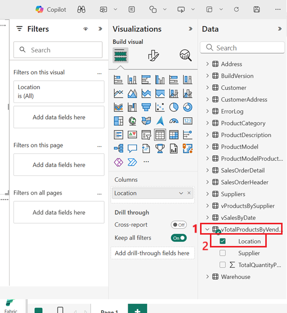
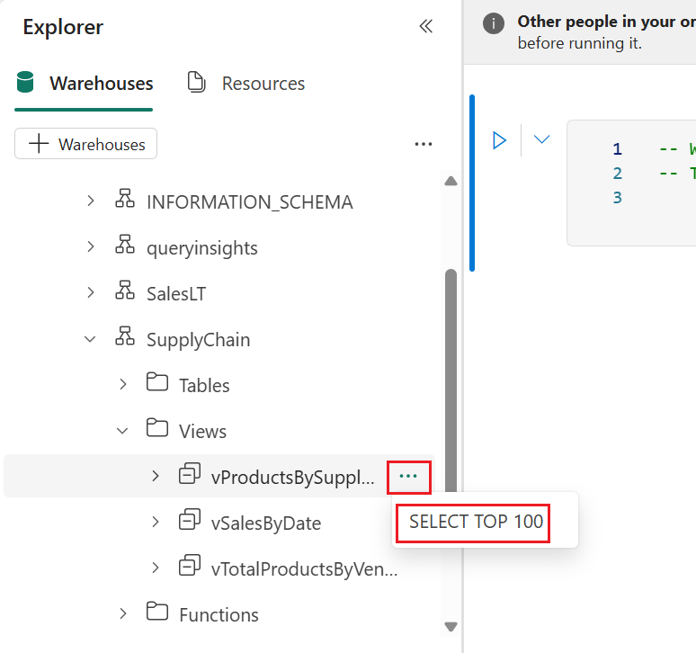
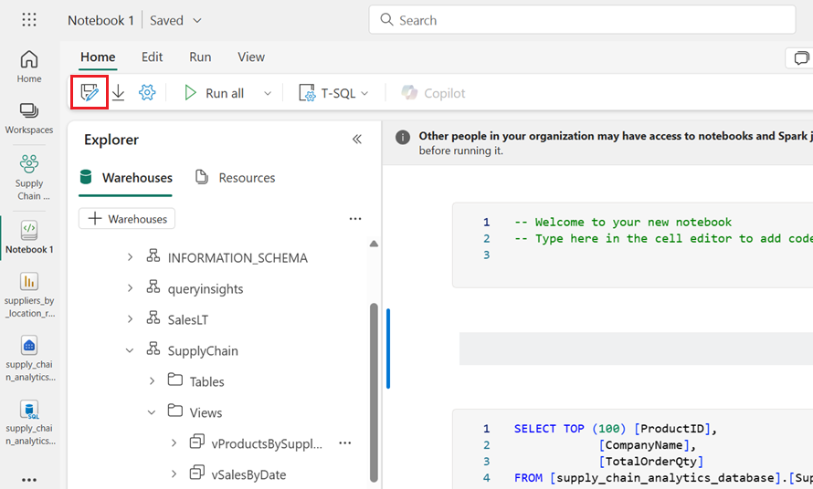

## Use Case 02 – Build a Supply Chain Disruption Response App using SQL database in Microsoft Fabric

**Introduction**

In today's dynamic global economy, supply chain disruptions can
significantly impact business operations. To address these challenges,
Microsoft Fabric offers a powerful platform for building responsive,
data-driven applications. This tutorial demonstrates how to leverage
Microsoft Fabric's SQL capabilities to build a Supply Chain Disruption
Response App. Through a series of guided exercises, users will learn to
create and manage SQL databases, ingest and analyze data, and visualize
insights using integrated tools like Power BI and Fabric Notebooks.

**Objective**

- Create and configure a SQL database within Microsoft Fabric.

- Ingest and manipulate supply chain data using T-SQL and data
  pipelines.

- Perform advanced data analysis and create views for reporting and
  visualization.

- Utilize the SQL analytics endpoint and GraphQL API to build
  interactive applications.

- Develop and share insightful Power BI reports based on real-time
  supply chain data.

## ­Exercise 1 – Create a New Fabric Workspace

The objective is to create a new Fabric workspace. By the end,
participants will confidently set up, manage, and collaborate within
their own Fabric workspaces.

### **Task-1: Create a New Fabric Workspace**

You can use an existing workspace or create a new Fabric workspace.  In
workspaces, you create collections of items such as lakehouses,
warehouses, and reports. You must be a member of the Admin or Member
roles for the workspace to create a SQL database.

To create a workspace:

1.  In the **Fabric** home page, select **+New workspace**.

    

2.  In the **Create a workspace tab**, enter the following details and
    click on the **Apply** button.

    |   |   |
    |---|---|
    |Name|	+++Supply Chain Analytics WorkspaceXX+++(XX can be a unique number)|
    |Advanced	|Under License mode, select Trial|

    

    

    

## Exercise 2 – Create a SQL Database in Microsoft Fabric 

1.  In the Fabric Portal, click on **+ New Item**, search for **SQL
    databases**, and select **SQL database (preview) tile.**

    

2.  Provide a name for the **New Database** as
    **+++supply_chain_analytics_database+++** Select **Create** button.

    

    

## Exercise 3 – Ingest sample data and create objects and data 

### **Task-1: Open the Query Editor in the Fabric Portal**

1.  Once the new database is created, open the database's home page.
    Select **Sample Data**.

    

2.  Check the Notifications area to ensure the import is complete before
    you proceed.

    

3.  Notifications show you when the import of the sample data is
    complete. Your SQL database in Fabric now contains
    the SalesLT schema and associated tables.

    

### **Task-2: Use the SQL database in the SQL Editor (Copilot)**

1.  In your database view, start by selecting **New Query** from the icon
    bar. This brings up a query editor. Type a T-SQL comment at the top
    of the query, such as:

    ```
    -- Create a query that shows the total number of customers
    ```
        
    Press Enter. You’ll get a result similar to this one:

    

2.  Pressing the "**Tab**" key implements the suggested code:

    

3.  Select **Run** button to run the query and review the results based
    on the query.

    

4.  Select **Explain query** from the icon bar of the Query Editor.

    

5.  **Explain query** option is used when you want to insert comments in
    your code to explain each major step.

    

### **Task-3: Insert data using Transact-SQL**

The following steps use a T-SQL script to create a schema, table, and
data for the simulated data for supply chain analysis.

1.  Select the **New Query** button in the toolbar of the SQL database
    to create a new query.

    

2.  Paste the following script in the Query area and select **Run** to
    execute it. The following T-SQL script

    1.  Creates a schema named **SupplyChain.**

    2.  Creates a table named **SupplyChain.Warehouse**.

    3.  Populates the **SupplyChain.Warehouse** table with some randomly
        created product data from **SalesLT.Product**.

    ```
    /* Create the Tutorial Schema called SupplyChain for all tutorial objects */
    CREATE SCHEMA SupplyChain;
    GO

    /* Create a Warehouse table in the Tutorial Schema
    NOTE: This table is just a set of INT's as Keys,  
    tertiary tables will be added later
    */

    CREATE TABLE SupplyChain.Warehouse (
    ProductID INT PRIMARY KEY  -- ProductID to link to Products and Sales tables
    , ComponentID INT -- Component Identifier, for this tutorial we assume one per product, would normalize into more tables
    , SupplierID INT -- Supplier Identifier, would normalize into more tables
    , SupplierLocationID INT -- Supplier Location Identifier, would normalize into more tables
    , QuantityOnHand INT); -- Current amount of components in warehouse
    GO

    /* Insert data from the Products table into the Warehouse table. Generate other data for this tutorial */
    INSERT INTO SupplyChain.Warehouse (ProductID, ComponentID, SupplierID, SupplierLocationID, QuantityOnHand)
    SELECT p.ProductID,
        ABS(CHECKSUM(NEWID())) % 10 + 1 AS ComponentID,
        ABS(CHECKSUM(NEWID())) % 10 + 1 AS SupplierID,
        ABS(CHECKSUM(NEWID())) % 10 + 1 AS SupplierLocationID,
        ABS(CHECKSUM(NEWID())) % 100 + 1 AS QuantityOnHand
    FROM [SalesLT].[Product] AS p;
    GO
    ```

    

    

    Your SQL database in Fabric database now includes Warehouse information.
    You'll use this data in a later step in this tutorial.

3.  You can select these tables in the **Explorer** pane, and the table
    data is displayed – no need to write a query to see it.

    

### **Task-4: Insert data using a Microsoft Fabric Pipeline**

Another way you can import data into and export data out of your SQL
database in Fabric is to use a Microsoft Fabric Data Pipeline. Data
pipelines offer an alternative to using commands, instead using a
graphical user interface. A data pipeline is a logical grouping of
activities that together perform a data ingestion task. Pipelines allow
you to manage extract, transform, and load (ETL) activities instead of
managing each one individually.

Microsoft Fabric Pipelines can contain a Dataflow. **Dataflow
Gen2** uses a Power Query interface that allows you to perform
transformations and other operations on the data. You'll use this
interface to bring in data from the *Northwind Traders* company, which
Contoso partners with. They're currently using the same suppliers, so
you'll import their data and show the names of these suppliers using a
view that you'll create in another step in this tutorial.

To get started, open the SQL database view of the sample database in the
Fabric portal.

1.  Select the **Get Data** button from the menu bar and Select **New
    Dataflow Gen2**.

    

    

2.  In the Power Query view, select the **Get Data** button. This starts
    a guided process rather than jumping to a particular data area.

    

3.  In the search box of the **Choose Data Source**, view
    type +++**odata**+++ and Select **OData** from the **New
    sources** results.

    

4.  In the URL text box of the **Connect to data source** view, type the
    text: +++**https://services.odata.org/v4/northwind/northwind.svc/**+++ for
    the Open Data feed of the **Northwind sample** database. Select
    the **Next** button to continue.

    

5.  In the **Data Destination** section, make sure to check that the
    **SQL database** is connected. 
    
    

6.  Select the **Publish** button to start the data transfer.

    

7.  You're returned to your Workspace view, where you can find the new
    Dataflow item.

    

    

8.  Select **supply_chain_analytics_database** SQL databse

    

9.  Refresh the database by clicking on the three
    dots **(...)** beside **supply_chain_analytics_database ,** then
    navigate and click on **Refresh**.

    

10. In the **Explorer**, expand the **dbo** schema to display the new
    table named **Suppliers**

    

11. The data is now ingested into your database. You can now create a
    query that combines the data from the Suppliers table using this
    tertiary table. You'll do this later in our tutorial.

## Exercise 4 – Query the database 

### **Task-1: Transact-SQL Queries**

You can type Transact-SQL (T-SQL) statements in a query window.

1.  In ribbon of the database in the Fabric portal, select the **New
    Query** button.

    

2.  Copy the following T-SQL script and paste it in the query window.
    This sample script performs a simple TOP 10 query, and creates a
    view based on a simple analytical T-SQL query. Select
    the **Run** button in the toolbar to execute the T-SQL query.

    ```
    -- Show the top 10 selling items 
    SELECT TOP 10
        [P].[ProductID],
        [P].[Name],
        SUM([SOD].[OrderQty]) AS TotalQuantitySold
    FROM [SalesLT].[Product] AS P
    INNER JOIN [SalesLT].[SalesOrderDetail] AS SOD ON [P].[ProductID] = [SOD].[ProductID]
    GROUP BY [P].[ProductID], [P].[Name]
    ORDER BY TotalQuantitySold DESC;
    GO

    /* Create View that will be used in the SQL GraphQL Endpoint */
    CREATE VIEW SupplyChain.vProductsbySuppliers AS
    SELECT COUNT(a.ProductID) AS ProductCount
    , a.SupplierLocationID
    , b.CompanyName
    FROM SupplyChain.Warehouse AS a
    INNER JOIN dbo.Suppliers AS b ON a.SupplierID = b.SupplierID
    GROUP BY a.SupplierLocationID, b.CompanyName;
    GO
    ```

    

    

### **Task-2: Performance Monitoring in SQL database in Fabric**

As your queries run in your SQL database in Fabric, the system collects
performance metrics to display in the **Performance Dashboard**. You can
use the Performance Dashboard to view database performance metrics, to
identify performance bottlenecks, and find solutions to performance
issues.

1.  On the **Home** toolbar in the Query with the SQL query editor,
    select **Performance summary**.

    

2.  The entire performance summary is displayed such as CPU consumption,
    Allocated size, User connections etc.

    

3.  To check the performance of Automatic Indexing, click on **View
    More** in the Automatic Index section.

    

4.  In the Fabric portal, the **Automatic Index** tab shows a history
    and status of automatically created indexes

    

### **Task-3: Backups in SQL database in Fabric** 

SQL database in Fabric automatically takes backups for you, and you can
see these backups in the properties that you access through the database
view of the Fabric portal.

1.  Click on the **Database editor**

    

2.  Select the **Settings** icon in the toolbar.

    

3.  Select the **Restore points** page. This view shows the recent point
    in time backups that have been taken on your database.

    

4.  Click on the Close

    

## Exercise 5 – Use the SQL analytics endpoint to query data 

### **Task-1: Query the data with the SQL analytics endpoint** 

You can query any of the mirrored data in the SQL analytics endpoint
using standard Transact-SQL statements that are compatible with a Fabric
warehouse. 

1.  You can access this mirrored data by selecting the SQL analytics
    endpoint in your Workspace view.

    

    

2.  On the **WideWorldImporters** page, go to the **Home** tab,
    select **SQL** from the drop down, and click on **New SQL query**.

    

    

3.  In this step, create a view over the mirrored data, and then create
    a report to show the results.

    Ensure you're in the SQL analytics endpoint, and then open a new Query
    window using the icon bar that depicts a paper with the
    letters **SQL** and paste the following Transact-SQL Code and
    select **Run** to execute it.

    ```
    CREATE VIEW SupplyChain.vProductsBySupplier AS
    -- View for total products  each supplier
    SELECT sod.ProductID
    , sup.CompanyName
    , SUM(sod.OrderQty) AS TotalOrderQty
    FROM SalesLT.SalesOrderHeader AS soh
    INNER JOIN SalesLT.SalesOrderDetail AS sod 
        ON soh.SalesOrderID = sod.SalesOrderID
        INNER JOIN SupplyChain.Warehouse AS sc 
            ON sod.ProductID = sc.ProductID
            INNER JOIN dbo.Suppliers AS sup 
                ON sc.SupplierID = sup.SupplierID
    GROUP BY sup.CompanyName, sod.ProductID;
    GO
    CREATE VIEW SupplyChain.vSalesByDate AS
    -- Product Sales by date and month
    SELECT YEAR(OrderDate) AS SalesYear
    , MONTH(OrderDate) AS SalesMonth
    , ProductID
    , SUM(OrderQty) AS TotalQuantity
    FROM SalesLT.SalesOrderDetail AS SOD
    INNER JOIN SalesLT.SalesOrderHeader AS SOH 
        ON SOD.SalesOrderID = SOH.SalesOrderID
    GROUP BY YEAR(OrderDate), MONTH(OrderDate), ProductID;
    GO
    CREATE VIEW SupplyChain.vTotalProductsByVendorLocation AS
    -- View for total products by each supplier by location
    SELECT wh.SupplierLocationID AS 'Location'
    , vpbs.CompanyName AS 'Supplier'
    , SUM(vpbs.TotalOrderQty) AS 'TotalQuantityPurchased'
    FROM SupplyChain.vProductsBySupplier AS vpbs
    INNER JOIN SupplyChain.Warehouse AS wh
        ON vpbs.ProductID = wh.ProductID
    GROUP BY wh.SupplierLocationID, vpbs.CompanyName;
    GO   
    ```
    

    

4.  This T-SQL query creates three new SQL views,
    named **SupplyChain.vProductsBySupplier**, **SupplyChain.vSalesByDate**,
    and **SupplyChain.vTotalProductsByVendorLocation**

    

    You can now use these views in analytics and reporting. You will create
    a report using these views in the further steps.

## Exercise 6 – Create and share visualizations.

### **Task-1: Find the connection strings to the SQL database.**

1.  Click on **supply_chain_analytics_database** database in the
    left-sided navigation bar.

    

2.  To get your server and database name, open your SQL database in
    Fabric portal view and select the **Settings** button in the icon
    bar.

    

3.  Select **Connection Strings** and you'll see a long string that
    starts with **Data Source...** From there, select the text between
    the characters **tcp:** through the characters **,1433**. Ensure
    that you select the entire set of characters there and nothing more
    for the server name.

    

4.  For the database name, select all the characters between the
    characters **Initial Catalog=** and **;MultipleActiveResultSets**.

    

    You can now use these SQL strings in your connection area for tools such
    as Power BI or SQL Server Management Studio. For Visual Studio Code with
    the mssql extension, you can paste the entire connection string in the
    first text box where you make a database connection, so you don't have
    to select only the server and database names.

### **Task-2: Power BI visualization creation**

As you work with the SQL analytics endpoint, it creates a Data model of
the assets. This is an abstracted view of your data and how it's
displayed and the relationship between entities. Some of the defaults
the system takes might not be as you desire, so you'll now change one
portion of the data model for this SQL analytics endpoint to have a
specific outcome.

1.  Click on **supply_chain_analytics_database** SQL analytics endpoint
    in the left-sided navigation bar.

    

2.  In your SQL analytics endpoint view, select the **Model
    layouts** button in the ribbon.

    

    

3.  From the resulting view, zoom in and scroll over until you see
    the **vTotalProductsByVendorLocation** object. Select it.

    

4.  In the properties, select the **Location** field, and expand
    the **Advanced** properties section. You might need to scroll to
    find it. Set the value of **Summarize by** to **None**. This ensures
    that when the field is used, it's a discrete number, not a
    mathematical summarization of that number.

    

### **Task-3: Create a report**

Here, the task is to create a report based on the views you created in
the SQL analytics endpoint in previous steps.

1.  Inside the SQL analytics endpoint view, select
    the **Reporting** button in the menu bar and then the **New
    report** button in the ribbon.

    

2.  From the **New report with all available data** that appears, select
    the **Continue** button.

    

    

3.  Now the Power BI canvas appears.

    

4.  Expand the **vTotalProductsByVendor **data object. Select each of
    the fields you see there. The report takes a moment to gather the
    results to a text view. You can size this text box if desired.

    

    

5.  Select in a blank area of the report canvas, and then
    select **Location** in the **Data** fields area.

    

    

6.  Select a value in the box you just created – notice how the first
    selection of values follows the selection you make in the second
    box. Select that same value again to clear the selection.

    

7.  Select in a blank area of the reporting canvas, and then select
    the **Supplier** field.

    

    

8.  Once again, you can select the name of a supplier and the first
    selection shows the results of just that supplier.

    

### **Task-4: Save the Power BI item for sharing** 

You can save and share your report with other people in your
organization.

1.  Select the **Save** button in the icon box.

    

2.  Name the report +++**suppliers_by_location_report**+++ and ensure
    you select the correct Workspace for this tutorial. Select **Save**
    button

    

    

3.  Select the **Share** button in the icon bar to share the report with
    people in your organization who have access to the proper data
    elements.

    

4.  Enter the user +++sample user1+++, which you created in Use Case 1,
    and select **Send** button.

    

    

## Exercise 7 – Perform data analysis using Microsoft Fabric Notebooks

### **Task-1: Data analysis with T-SQL notebooks**

1.  Click on **Supply Chain Analytics Workspace** workspace in the
    left-sided navigation bar.

    

2.  In the **Fabric** page, select **+New item**. Then, select
    **Notebook** tile.

    

3.  In the icon bar, change the environment from **PySpark
    (Python)** to **T-SQL**.

    

4.  In each code cell, there is a drop-down list for the code language.
    In the first cell in the Notebook, change the code language
    from **PySpark (Python)** to **T-SQL**.

    

5.  Select the **+ Warehouses** button.

    

6.  Select the **SQL analytics endpoint** object that is named
    **supply_chain_analytics_database**. Select **Confirm**.

    

    

7.  Expand the database, expand **Schemas**. Expand
    the **SupplyChain** schema. Expand **Views**, and locate the SQL
    view named **vProductsBySupplier**.

    

8.  Select the ellipses next to that view. and select the option that
    says **SELECT TOP 100**.

    

9.  This creates a cell with T-SQL code that has the statements
    pre-populated for you. Select the **Run Cell** button for the cell
    to run the query and return the results.

    

    

10. In the results, you can see not only the data requested, but buttons
    that allow you to view charts, save the data as another table,
    download, and more. 

    

11. To the side of the results you can see a new pane with quick
    **inspection** of the data elements, showing minimum and maximum
    values, missing data, and unique counts of the data returned.

    

    

12. Hovering between the code cells shows you a menu to add another
    cell. Select the **+ Markdown** button.

    

    

13. This places a text-based field where you can add information.
    Styling for the text is available in the icon bar, or you can select
    the \</\> button to work with Markdown directly. The result of the
    formatting show as a preview of the formatted text.

    

    

14. Select the **Save As** icon in the ribbon.

    

15. Enter the text +++products_by_suppliers_notebook+++. Ensure you set
    the location to your tutorial Workspace. Select the **Save** button
    to save the notebook.

    

    

## Exercise 8 – Create an application with DevOps and GraphQL API

### **Task-1: Create an Organization and Project in Microsoft Azure DevOps**

1.  Navigate to +++https://go.microsoft.com/fwlink/?LinkId=307137+++ and sign-in with
    your tenant username and password.

    

2.  Approve sign-in request from your
    **authenticator** app.

    

3.  Select **Continue** to get started
    with Azure DevOps.

    

4.  Enter the name for your
    organization, select its hosting geography, and then
    select **Continue**.

    

    

**Congratulations, you're an organization owner!**

5.  You’ll be redirected to this page and make sure you’re into the
    organization that you have created in the above step.

6.  To create a **new project**, enter a
    project name as +++**Supply-Chain-Disruption-App**+++ and select the
    visibility as **Private**. Click on **Create** **project.**

    

### **Task-3: Create a repository in the same project**

1.  Navigate to **Files** option under
    **Repos** section. From the repo **drop-down** at the top,
    select **new repository**.

    

2.  In the **Create a new repository** dialog, verify that Git is the
    repository type and enter a name – +++**SupplyChainAnalytics**+++ for your
    new repository. 
    To add a **README**, check the checkbox.

    When you're happy with the repo name and choices, select **Create**.

    

### **Task-4: Connect your workspace to the source control (Azure DevOps)**

1.  Navigate to **Fabric portal**, go to
    the workspace you want to connect and select "**Workspace
    settings"**. 

    

2.  Under Git Integration settings,
    select **Azure DevOps** as your Git provider and the Entra user as
    well. Click on **Connect**.

    

3.  You'll be **automatically signed** into the Azure Repos account
    registered to the **Microsoft Entra user** signed into Fabric. 

4.  **Provide Repository Details:**

    1.  **Organization:** Select your Azure DevOps organization
        **FabricTestProject** that you have created in earlier steps.

    2.  **Project:** Choose the project **Supply-Chain-Disruption-App**
        where your repository is located. 

    3.  **Git Repository:** Select the repository i.e.,
        **SupplyChainAnalytics**. 

    4.  **Branch:** Specify the **main** branch you want to connect the
        workspace.

    5.  **Git Folder:**  Specify a folder within the branch where Fabric
        items will be stored. If not created already in Azure DevOps
        portal, it’ll be created from here as well. You can mention the
        folder name as +++**SampleWorkload**+++.

        Click on **Connect and Sync**.

    

5.  Now that you have mentioned the folder name which not created
    earlier, give a confirmation by clicking on **Create and Sync** to
    establish the connection and synchronize the workspace with the Git
    repository.

    

6.  Workspace is now connected to the source control. The items in the
    workspace will automatically by synced. It might take 5-10 mins.
    Ensure that the Workspace is set up to be under source control and
    all objects show **Synced** status.

    

7.  In the Workspace view, you'll see the git icon, the branch you
    selected, and a message about the last time the Workspace was
    synchronized with source control. Next to the date and time, you'll
    see an **identifier link** for the specific location in your Azure
    DevOps environment. **Open that link to continue**.

8.  Sign in to your Azure DevOps environment if requested.

9.  Once inside the Azure DevOps
    environment, select the **Files** item in the explorer pane. The
    objects synchronized with your SQL database in Fabric and the
    repository are displayed.

    

### **Task-5: Interact with SQL Database object schemas from source control in Azure Devops**

1.  Expand the **suppy_chain_analytics_database.SQLDatabase**, then **dbo**,
    then **Tables** and then **Suppliers.sql** object.

    

    Notice the T-SQL definition of the table in the object contents. In a
    production coding environment, this object would be altered using
    development tools such as Visual Studio, or Visual Studio Code. In
    this lab, we are using Azure DevOps source control to make some
    changes to the database objects in the further steps.

2.  Locate the **\[Fax\] column**
    definition line and select the **Edit** button. Edit the column
    definition to **\[Fax\] NVARCHAR (255) NULL**.

    

3.  Select the **Commit** button.

    

4.  Fill out the **Commit** message box
    that appears and select the **Commit** button. Try to be descriptive
    of every change in source control, for your and your team's benefit.

    

5.  The commit writes the change to the repository.

    

6.  Switch back to the SQL database in
    Fabric portal, and then select **Source Control**. You have one
    update pending.

    

7.  In production, you'll review these
    changes. Select the **Update All** button. The update might take
    some time.

    

8.  Select the SQL database in Fabric name.

    

9.  Open a new query window in your SQL database. Copy and paste the
    following T-SQL code to see the changes to the table live in the
    database:

    +++SELECT \* FROM > INFORMATION_SCHEMA.COLUMNS WHERE TABLE_NAME = 'Suppliers';+++

    

10. Enter the following T-SQL code that query to add a column
    named Notes to the ***Suppliers*** table. Highlight just that
    section of code and select the ***Run*** button:

    +++ALTER TABLE Suppliers ADD Notes NVARCHAR(MAX);+++

    

11. Now return to the **tutorial Workspace** in the Fabric portal.

    Select the **Source**
    **Control** button and notice that rather than an **Update**, your
    system shows a **Change** request. Select the check box next to the
    object name and then select the **Commit** button.

    

12. The system commits the changes made
    in the query editor, and you can return to the Azure DevOps Portal
    and navigate to the **Files** area and the dbo Schema and then
    the **Tables** and Suppliers object to see the new column. *(You
    might need to refresh the page to see the change.)*

    

## Exercise 9: Setup and Configure the GraphQL API

To create the API for GraphQL that you'll use for an application:

1.  Click on **Supply Chain Analytics Workspace** workspace in the
    left-sided navigation bar.

    

2.  In the **Fabric** page, select **+New item**. Then, select **API for
    GraphQL** tile.

    

3.  Enter the text **supplier_impact_gql** for the **Name** for your
    item and select **Create**.

    

4.  Select **data source** card displayed to add the data for GraphQL.

    

5.  On **Choose connectivity option** dialog box, select **Connect to
    Fabric data sources with single-on (SSo) authentication** and click
    on **Ok** button.

    

6.  In the OneLake catalog tab, select the
    **supply_chain_analytics_database** and click on the '**Connect'**
    button

    

7.  You are presented with a **Choose Data** panel. Scroll until you
    find ***SupplyChain.vProductsBySuppliers***, the view you created
    earlier in this tutorial.
    Select it and click on **Load** button.

    

8.  In the Query1 panel, replace the text you see there with the
    following GraphQL query string:

    +++query { vProductsbySuppliers(filter: { SupplierLocationID: { eq: 7 }}) { items { CompanyName SupplierLocationID ProductCount } } }+++

9.  Select the **Run **button in the Query1 window. The results of the
    GraphQL query are returned to the Results window in JSON format.

    

    

10. Select the **Copy** **endpoint** button in the ribbon.

    

11. Select the **Copy button** when the Copy link panel appears. Store
    this string in a notepad or other location to be used in the sample
    application for this tutorial.

    

    

    **Your API for GraphQL is now ready to accept connections and
    requests. **

## Exercise 10 – Create a web application using the SQL database in Fabric API for GraphQL

In this exercise, we will be creating an application that shows all
affected Suppliers if a Location has a supply chain break, due to
natural disasters or other interruptions. This code shows how to create
an ASP.NET application that uses a GraphQL Query to access a Query in
the SQL In Fabric GraphQL endpoint you created in the previous task.

### **Task-1: Install .NET SDK for your operating system**

1.  Navigate to this URL to **download** **.NET SDK** -
    +++https://dotnet.microsoft.com/en-us/download+++

2.  You will find the following webpage once you go to the above
    website. The latest version at this point is **.NET 9.0**, which
    provides Standard-Term Support and is recommended. Click on
    **Download .NET SDK x64.**

    

3.  Once you download the **.NET SDK**,
    install it by double-clicking the downloaded **exe** file. Once you
    click on the EXE, it will open the following window. In this window,
    click on the **Install** button.

    

4.  If everything is fine, once the
    installation is completed, you will get the following message saying
    the **installation was successful**: Click on the **Close** button.

    

5.  Now, to verify what version is
    installed on your machine, type the **dotnet –version** command in
    the command prompt and press the enter button.

    

### **Task-2: Creating a web application in Visual Studio Code**

    You can refer
    <https://github.com/Azure-Samples/siftutorial/blob/main/README.md> for
    this particular task.

1.  Open **Visual Studio Code**, click
    on the three dots at the top pane and select **Terminal** and then
    **New terminal** option from the drop-down.

    

2.  Open a terminal or command prompt. Run the following commands one by
    one to create a new ASP.NET Core web application.

    +++dotnet new webapp -n GraphQLWebApp+++

    +++cd GraphQLWebApp+++

    This command will create a new **ASP.NET Core Web App** project in the
    directory mentioned. You can check the **directory**, there must be a
    **GraphQLWebApp** folder created.

    

3.  Now to proceed, **open** the web app
    folder in **Visual Studio Code** by navigating to **File** option in
    the top pane, select **Open Folder** option from the drop down and
    select the web app folder named **GraphQLWebApp** from the
    directory.

    

4.  **Add the necessary packages:**

    Run the following commands one by one to add the required packages:

    +++dotnet add package Azure.Identity+++

    +++dotnet add package GraphQL+++

    +++dotnet add package GraphQL.Client+++

    +++dotnet add package GraphQL.Client.Serializer.Newtonsoft+++

    

    

    

    

5.  **Add the Azure CLI software and log in to your subscription:**

    Run the following command to add the required software:

    +++winget install -e --id Microsoft.AzureCLI+++

    

    

    

6.  Install the Azure CLI Tools extension.**

    

7.  **Run the following command to login with your Entra User
    credentials.**

    +++az login+++

    If prompted, select the **Subscription** **ID** you used to create the
    tutorial assets.

    

4.  **Modify the Program.cs file**:

    - Open the Program.cs file and replace its content with the
      following code. You can also copy this entire code from this
      reference link
      <https://github.com/Azure-Samples/siftutorial/blob/main/README.md> or you can paste it from here:

    ```
    /* Program.cs
    Purpose: This tuorial program shows how to create a simple web application that uses a GraphQL query to return data from a Power BI dataset. 
    Uses the GraphQL.Client library to send the query to the Power BI service, and then displays the results in a web page. 
    Uses the DefaultAzureCredential class from the Azure.Identity library to authenticate with Azure Active Directory and 
    get an access token to use in the query. 
    It uses the WebApplication class from the Microsoft.AspNetCore.Components.WebAssembly.Hosting library to create a web application, 
    and the GraphQLHttpClient class from the GraphQL.Client library to send the query. 
    It also uses the GraphQLHttpRequest class from the GraphQL.Client library to define the query, and the NewtonsoftJsonSerializer 
    class from the GraphQL.Client.Serializer.Newtonsoft library to serialize the response. 
    We use the WriteAsync method of the HttpResponse class to write the HTML response to the web page.

    Requirements: To run this program, you need to have the .NET SDK installed on your machine. 
    You also need to have an Azure subscription and a Power BI dataset with a GraphQL API enabled.
    You should install the required libraries with the following commands:

    dotnet add package GraphQL.Client --version 3.3.0
    dotnet add package GraphQL.Client.Serializer.Newtonsoft --version 3.3.0
    dotnet add package Microsoft.AspNetCore.Components.WebAssembly.Hosting --version 5.0.7
    dotnet add package Azure.Identity --version 1.4.1

    Author: Buck Woody, Microft Corporation 
    Last Modified: 2021.09.01
    */

    // Set up your libraries
    using GraphQL.Client.Http;
    using GraphQL.Client.Serializer.Newtonsoft;
    using Azure.Identity;

    // Make a connection to Azure, and get a token
    var credential = new DefaultAzureCredential();
    var token = await credential.GetTokenAsync(new Azure.Core.TokenRequestContext(new[] { "https://analysis.windows.net/powerbi/api/.default" }));

    // Set up your web application
    var builder = WebApplication.CreateBuilder(args);
    // Add services to the container.
    builder.Services.AddRazorPages();
    // Build the application
    var app = builder.Build();

    // Configure the HTTP request pipeline.
    app.UseStaticFiles();
    app.UseRouting();

    // Add the Razor pages
    app.MapRazorPages();
    // Add the GraphQL query initial web page
    app.MapGet("/", async context =>
    {
        var html = @"
    <!DOCTYPE html>
    <html lang='en'>
    <head>
        <meta charset='UTF-8'>
        <meta name='viewport' content='width=device-width, initial-scale=1.0'>
        <title>Product Count by Suppliers</title>
        <link rel='stylesheet' href='https://stackpath.bootstrapcdn.com/bootstrap/4.3.1/css/bootstrap.min.css'>

        <style>
            .form-inline .form-control {
                width: auto;
                flex: 0 0 50px; /* Adjust the width as needed */
            }
            .form-inline .btn {
                margin-left: 10px; /* Adjust the margin as needed */
            }
        </style>
    </head>

    <body>
        <div class='container mt-5'>
        
            <h3>Product Count by Suppliers</h3>
            <p><i>Supplier Network Control Center - Supplier Sector Impact Zones by Product (Function NCC-1701)</i></p>
            <p>Enter the impacted Location ID for the Supplier that is facing the outage. The system will return the other Suppliers within that impact area and show the count of items each Supplier provides to Manufacturing.</p>
            <form method='get' action='/graphql' class='form-inline'>
                <label for='locationId' class='mr-2'>Location ID:</label>
                <input type='text' class='form-control' id='locationId' name='locationId' required>
                <button type='submit' class='btn btn-primary'>Search</button>
            </form>
            <div id='result'></div>
        </div>
    </body>

    </html>";
    // Return the HTML
        await context.Response.WriteAsync(html);
    });

    // Add the GraphQL query
    app.MapGet("/graphql", async context =>
    {
        var locationId = context.Request.Query["locationId"];
        if (string.IsNullOrEmpty(locationId))
        {
            await context.Response.WriteAsync("Location ID is required.");
            return;
        }

    // Set up the GraphQL client - your endpoint goes here
        var graphQLOptions = new GraphQLHttpClientOptions
        {
            EndPoint = new Uri("ReplaceWithYourGraphQLEndpointAddress"),
            MediaType = "application/json",
        };

    // Set up the client with headers, use the token
        var graphQLClient = new GraphQLHttpClient(graphQLOptions, new NewtonsoftJsonSerializer());
        graphQLClient.HttpClient.DefaultRequestHeaders.Authorization = new System.Net.Http.Headers.AuthenticationHeaderValue("Bearer", token.Token);
        graphQLClient.Options.IsValidResponseToDeserialize = response => response.IsSuccessStatusCode;
    // Set up the GraphQL query - you could make this a variable if you wanted to
        var query = new GraphQLHttpRequest
        {
            Query = $@"query {{ vProductsbySuppliers(filter: {{ SupplierLocationID: {{ eq: {locationId} }} }}) 
            {{ items 
                {{ CompanyName SupplierLocationID ProductCount }} 
            }} 
            }}"
        };
    // Send the query
        var graphQLResponse = await graphQLClient.SendQueryAsync<dynamic>(query);
        var items = graphQLResponse.Data.vProductsbySuppliers.items;

    // Build the HTML response from the query
        var html = @"
        <!DOCTYPE html>
        <html>
        <head>
            <link rel='stylesheet' href='https://stackpath.bootstrapcdn.com/bootstrap/4.3.1/css/bootstrap.min.css'>
        </head>
        <body>
            <div class='container'>
            
                <h2>Product Count by Suppliers</h2>
                <table class='table table-striped'>
                    <thead>
                        <tr>
                            <th>Company Name</th>
                            <th>Supplier Location ID</th>
                            <th>Product Count</th>
                        </tr>
                    </thead>
                    <tbody>";

        foreach (var item in items)
        {
            html += $"<tr><td>{item.CompanyName}</td><td>{item.SupplierLocationID}</td><td>{item.ProductCount}</td></tr>";
        }

        html += @"
                    </tbody>
                </table>
            </div>
        </body>
        </html>";
    // Return the HTML
        await context.Response.WriteAsync(html);
    });
    // Run the application
    app.Run();
    ```

    

5.  **Run the application:**

    - In the terminal or command prompt, run the following command to
      start the application:

    +++dotnet run+++

5.  **Access the application**:

    - Right-click on the line in your command window that looks similar
      to +++**http://localhost:5261**+++ to see the output of your GraphQL
      query.

    
    
    

## Exercise 10 – Clean up resources

1.  In the left navigation bar, select the icon for your workspace to
    view all of the items it contains.

    

2. In the menu on the top toolbar, select **Workspace settings**.

    

3. In the **General** section, select **Remove this workspace**.

    

    

**Summary**

This usecase provides a comprehensive, hands-on guide to building a
Supply Chain Disruption Response App using Microsoft Fabric's SQL
database features. It walks users through creating a workspace, setting
up a SQL database, ingesting sample and external data, and performing
data transformations. Users also learn to create analytical views,
monitor performance, and visualize data using Power BI. The tutorial
concludes with the setup of a GraphQL API for application integration
and guidance on cleaning up resources. By completing this tutorial,
users gain practical experience in managing and analyzing supply chain
data within a unified analytics environment.
