# ­Lab 1 – Build a Fabric Database for AdventureWorks for querying, reporting, and sharing the data

This lab revolves around creating a SQL database in Microsoft Fabric
guides that users through the process of setting up a new SQL database
within the Fabric portal. It outlines the necessary prerequisites, such
as having an existing Fabric capacity and appropriate workspace roles.
The tutorial provides step-by-step instructions for creating the
database, including options to import sample data, use the T-SQL web
editor for creating database objects, and create GraphQL API from the
SQL database.

## Exercise 1 – Set up your environment

### **Task-1: Start a Fabric Capacity Trial**

Follow these steps to start your Fabric capacity trial and become the
Capacity administrator of that trial.

1.  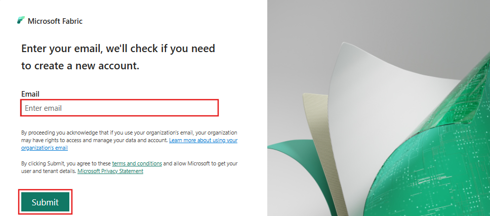Open your browser and browse the **Microsoft
    Fabric Trial Page** <https://app.fabric.microsoft.com/> and sign-in
    with your credentials and click on submit.

2.  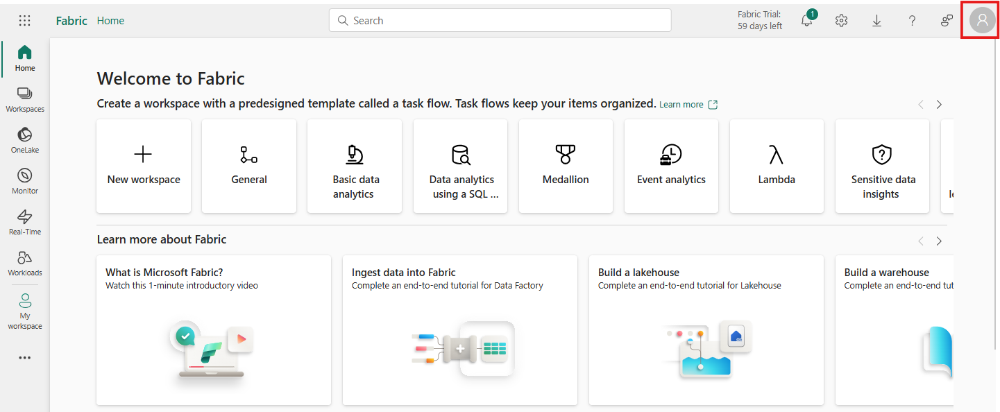On the Trial Page, Click on the **Account**
    **Manager**.

3.  In the Account manager, select **Free trial**. If you don't
    see **Free trial** or **Start trial** or a **Trial status**, trials
    might be disabled for your tenant.

> **Note:** If the Account manager already displays **Trial status**,
> you may already have a **Power BI trial** or a **Fabric (Free)
> trial** in progress. To test this out, attempt to use a Fabric
> feature. For more information, see [**Start using
> Fabric**](https://learn.microsoft.com/en-us/fabric/fundamentals/fabric-trial#other-ways-to-start-a-microsoft-fabric-trial).
>
> 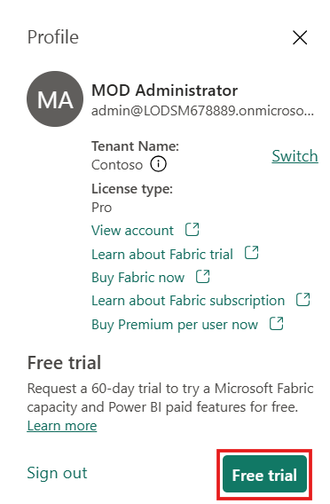

4.  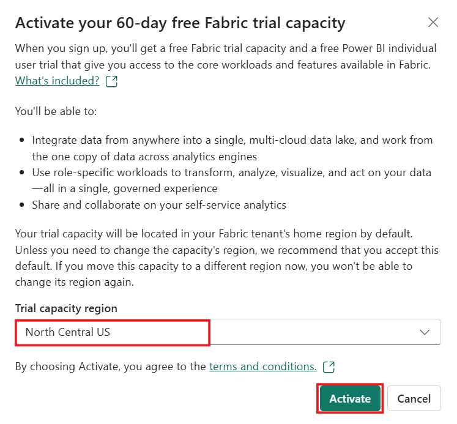If prompted, agree to the terms and select
    the appropriate Trial capacity region and then select **Activate**.

5.  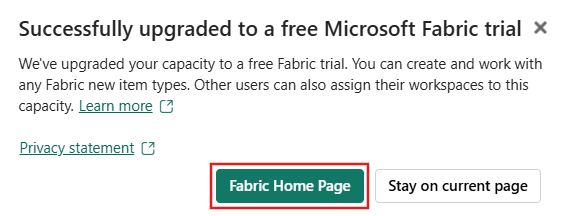Once your trial capacity is ready, you
    receive a confirmation message. Select **Fabric Home Page** to begin
    working in Fabric. You're now the Capacity administrator for that
    trial capacity.

6.  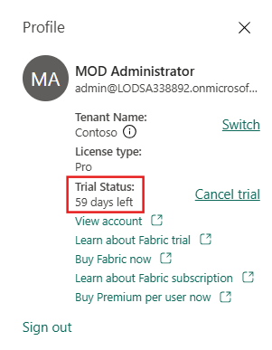Open your Account manager again. Notice the
    heading for **Trial status**. Your Account manager keeps track of
    the number of days remaining in your trial.

Congratulations. You now have a Fabric trial capacity that includes a
Power BI individual trial (if you didn't already have a Power
BI *paid* license) and a Fabric trial capacity.

### **Task-2: Create a New Fabric Workspace**

You can use an existing workspace or create a new Fabric workspace.  In
workspaces, you create collections of items such as lakehouses,
warehouses, and reports. You must be a member of the Admin or Member
roles for the workspace to create a SQL database.

To create a workspace:

1.  From left pane, select **Workspaces** \> **New workspace**.

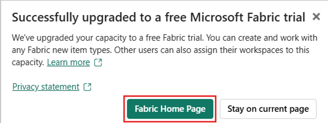

2.  The Create a workspace pane opens.

    - Give the workspace a unique name (mandatory).

    &nbsp;

    - Provide a description of the workspace (optional).

    &nbsp;

    - Assign the workspace to a domain (optional).

> If you are a domain contributor for the workspace, you can associate
> the workspace to a domain, or you can change an existing association.
>
> 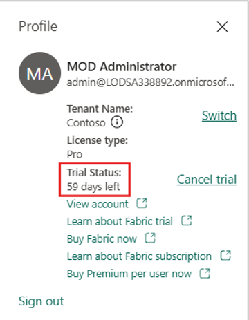

3.  When done, either continue to the advanced settings, or
    select **Apply**.

## Exercise 2 – Enable SQL Database in your Fabric 

### **Task-1: Enable SQL database for your tenant**

Follow these steps to enable SQL database for your tenant.

1.  Go to **settings** option in Fabric and select **Admin portal**.

2.  Enable the **Users can create Fabric items** switch and click on
    **Apply**. 

3.  Enable **SQL database
    (preview)** switch and click on Apply.

### **Task-2: Enable SQL Database for a capacity**

Follow these steps to enable SQL database in Microsoft Fabric for a
specific capacity:

1.  Navigate to the **tenant**
    **capacity** settings in the admin portal.

2.  Expand the **SQL database
    (preview)** setting.

3.  Toggle the **enable** switch to
    enable the SQL database (preview) and click on **Apply**.

## Exercise 3 – Create a SQL Database in the Fabric Portal

1.  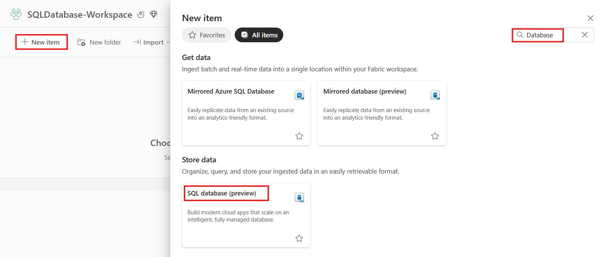In the Fabric Portal, select **+ New Item**,
    and search for **SQL Databases (preview)** tile.

2.  Provide a name for the **New Database**. Select **Create**.

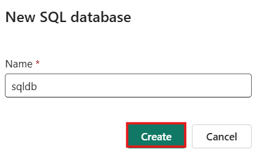

3.  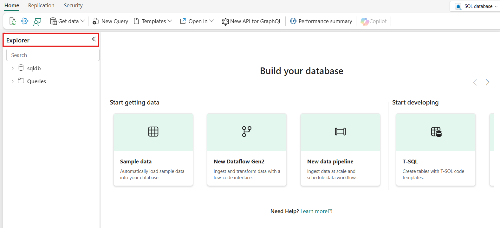When the new database is provisioned, on
    the **Home** page for the database, notice the **Explorer** pane
    showing database objects.

4.  Under **Build your database**, three useful tiles can help you get
    your newly created database up and running.

    - **Sample data** option lets you import a sample data into
      your **Empty** database.

    &nbsp;

    - **T-SQL** option gives you a web-editor that can be used to write
      T-SQL to create database object like schema, tables, views, and
      more. For users who are looking for code snippets to create
      objects, they can look for available samples in **Templates** drop
      down list at the top of the menu.

    &nbsp;

    - 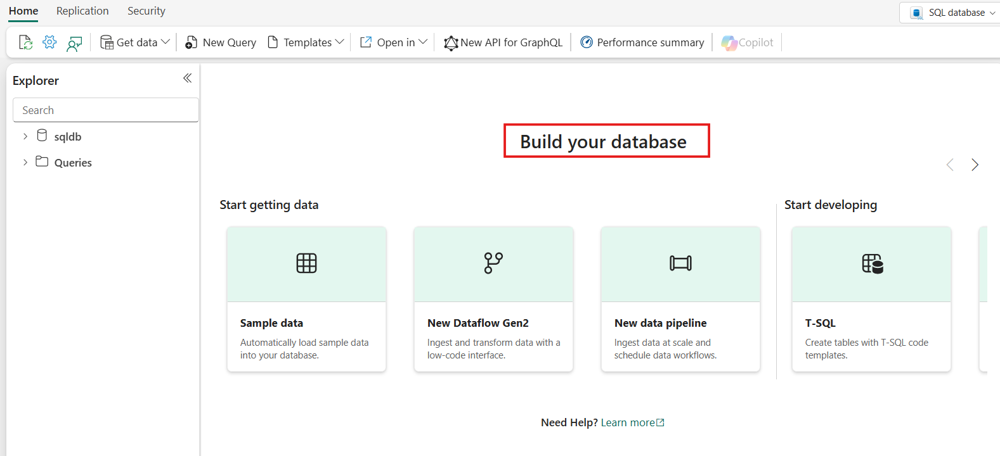**Connection strings** option shows the
      SQL database connection string that is required when you want
      to connect using SQL Server Management Studio, the mssql extension
      with Visual Studio Code, or other external tools.

## Exercise 4 - Load AdventureWorks sample data in your SQL database in Microsoft Fabric

1.  Once the new database is created, open the database's home page.
    Select **Sample Data**.

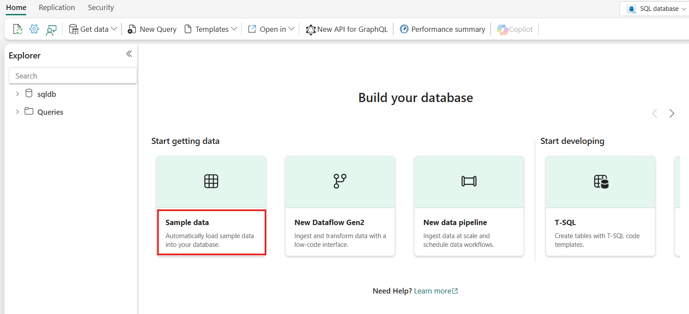

2.  You'll see a **Loading Sample Data** notification.

    - Don't modify the database while the import is in process.

> 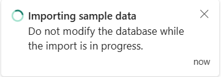

3.  Once complete, there's a notification. The object explorer also
    refreshes to show the new **SalesLT** schema. You're now ready to
    get started with the AdventureWorksLT sample database.

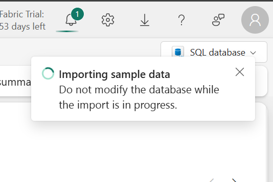

4.  Expand the SalesLT schema in the **Object Explorer** to see the
    objects that were created. Select on any of the tables to quickly
    view the data.

    - 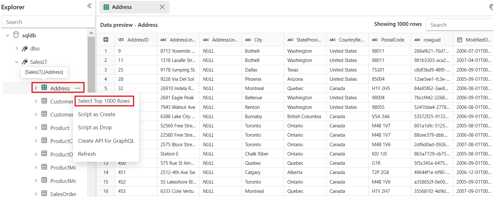For more options, like select top 100 rows
      or to script an object out, right-click or select the context menu
      (...) of the object name.

## Exercise 5 – Create a table in SQL Database in Fabric

### **Task-1: Create a table with T-SQL Queries**

1.  Open your SQL database.

2.  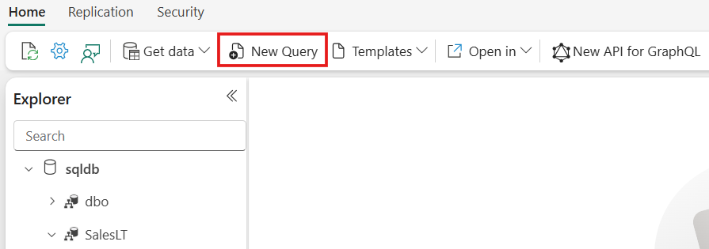Select the **New Query** button in the main
    ribbon.

3.  Create the definition of your table in T-SQL with the help of this
    sample:

> **SQL**

CREATE TABLE dbo.products (

product_id INT IDENTITY(1000,1) PRIMARY KEY,

product_name VARCHAR(256),

create_date DATETIME2

)

> 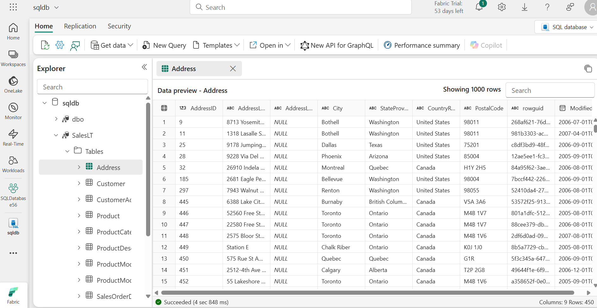

4.  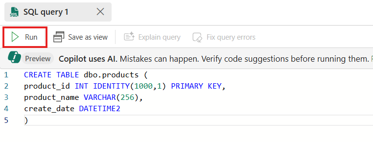Once you have a table design you like,
    select **Run** in the toolbar of the query window.

5.  If the **Object Explorer** is already expanded to show tables, it
    will automatically refresh to show the new table upon create. If
    not, expand the tree to see the new table.

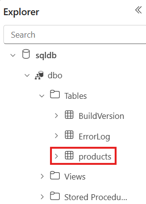

### **Task-2: Creating a table with Copilot**

1.  Open your SQL database.

2.  Select the **New Query** button in the main ribbon.

3.  Type in the following text as a T-SQL comment into the query window
    and press **Tab** on your keyboard:

> **SQL**

--create a new table that to store information about products with some
typical columns and a monotonistically increasing primary key called
ProductID

4.  After a few seconds, Copilot will generate a suggested T-SQL script
    based on the prompt.

5.  Press the **Tab** key again to accept Copilot's suggestion. It
    should look something like this:

> **SQL**

--create a new table that to store information about products with some
typical columns and a monotonistically increasing primary key called
ProductID

CREATE TABLE \[dbo\].\[ProductInformation\] (

-- Primary Key for the ProductInformation table

\[ProductID\] INT IDENTITY(1,1) PRIMARY KEY,

-- Name of the product

\[ProductName\] VARCHAR(100) NOT NULL,

-- Description of the product

\[Description\] VARCHAR(MAX),

-- Brand of the product

\[Brand\] VARCHAR(50),

-- List price of the product

\[ListPrice\] DECIMAL(10, 2),

-- Sale price of the product

\[SalePrice\] DECIMAL(10, 2),

-- Item number of the product

\[ItemNumber\] VARCHAR(20),

-- Global Trade Item Number of the product

\[GTIN\] VARCHAR(20),

-- Package size of the product

\[PackageSize\] VARCHAR(50),

-- Category of the product

\[Category\] VARCHAR(50),

-- Postal code related to the product

\[PostalCode\] VARCHAR(10),

-- Availability of the product

\[Available\] BIT,

-- Embedding data of the product

\[Embedding\] VARBINARY(MAX),

-- Timestamp when the product was created

\[CreateDate\] DATETIME

);

6.  Review and edit Copilot's suggested T-SQL to better fit your needs.

7.  Once you have a table design you like, select **Run** in the toolbar
    of the query window.

8.  If the **Object Explorer** is already expanded to show tables, it
    will automatically refresh to show the new table upon create. If
    not, expand the tree to see the new table.

## Exercise 6 – Query the SQL Analytics Endpoint of your SQL Database in Fabric

### **Task-1: Access the SQL Analytics Endpoint**

The SQL analytics endpoint can be queried with T-SQL multiple ways:

- The first is via the workspace. Every SQL database is paired with a
  default semantic model and a SQL analytics endpoint. The semantic
  model and the SQL analytics endpoint always show up together with the
  SQL database in item listing of the workspace. You can access any of
  them by selecting them by name from the list.

- The SQL analytics endpoint can also be accessed from within the SQL
  query editor. This can be especially useful when toggling between the
  database and the SQL analytics endpoint. Use the pulldown in the upper
  right corner to change from the editor to the analytics endpoint.

- The SQL analytics endpoint also has its own SQL connection string if
  you want to query it directly from tools like [SQL Server Management
  Studio](https://learn.microsoft.com/en-us/fabric/database/sql/connect#connect-with-sql-server-management-studio-manually) or [the
  mssql extension with Visual Studio
  Code](https://learn.microsoft.com/en-us/sql/tools/visual-studio-code/mssql-extensions?view=fabric&preserve-view=true).
  To get the connection strings, see [Find SQL connection
  strings](https://learn.microsoft.com/en-us/fabric/database/sql/connect#find-sql-connection-string).

### **Task-2: Query the SQL Analytics Endpoint**

1.  Open an existing database that was loaded with the sample data.

2.  Expand the **Object Explorer** and make note of the tables in the
    database.

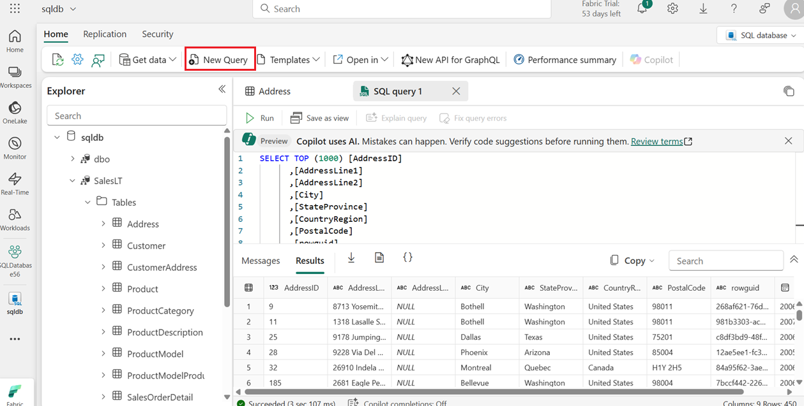

3.  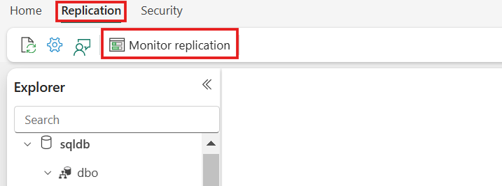Select the replication menu at the top of
    the editor, select **Monitor Replication**.

4.  A list containing the tables in the database will appear. If this is
    a new database, you'll want to wait until all of the tables have
    been replicated. There is a refresh button in the toolbar. If there
    are any problems replicating your data, it is displayed on this
    page.

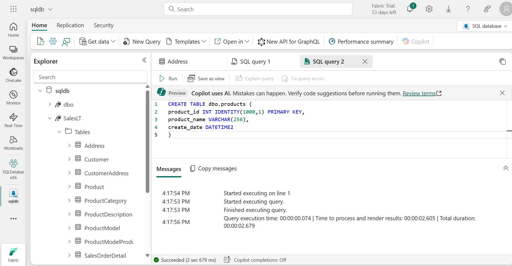

5.  Once your tables are replicated, close the **Monitor
    Replication** page.

6.  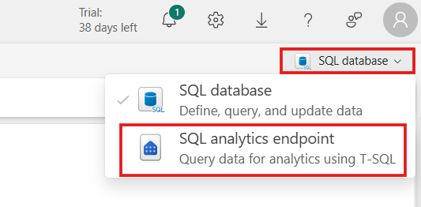Select the SQL analytics endpoint from the
    dropdown in the SQL query editor.

7.  You now see that the **Object Explorer** changed over to the
    warehouse experience.

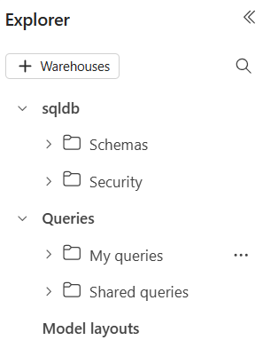

8.  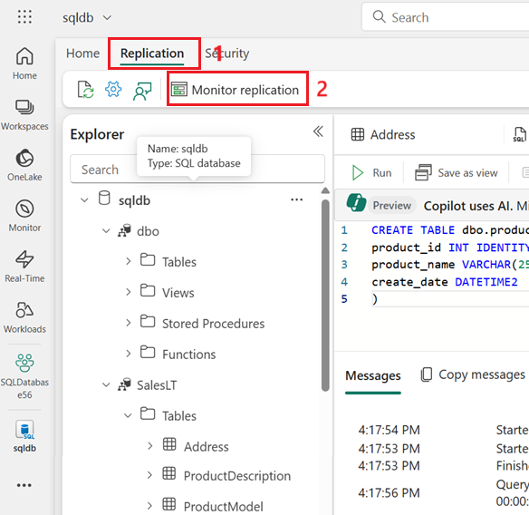Select some of your **tables** to see the
    data appear, reading directly from OneLake.

9.  Select the context menu (...) for any table, and
    select **Properties** from the menu. Here you can see the OneLake
    information and ABFS file path.

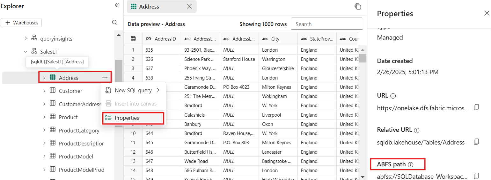

10. 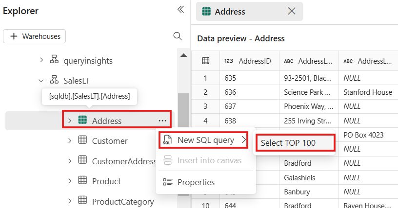Close the **Properties** page and select the
    context menu (...) for one the tables again. Select **New
    Query** and **SELECT TOP 100**.

11. Run the query to see the top 100 rows of data, queried from the SQL
    analytics endpoint, a copy of the database in OneLake.

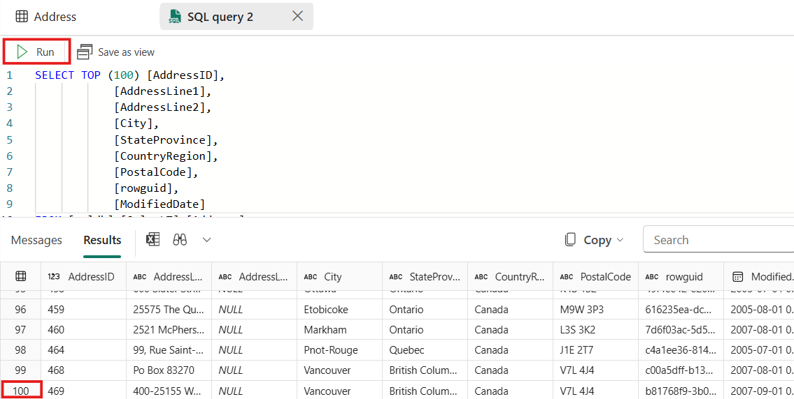

12. If you have other databases in your workspace, you can also run
    queries with cross-database joins. Select the **+ Warehouse** button
    in the **Object Explorer** to add the SQL analytics endpoint for
    another database. You can write T-SQL queries similar to the
    following that join different Fabric data stores together:

> **SQL**

SELECT TOP (100) \[a.AccountID\],

\[a.Account_Name\],

\[o.Order_Date\],

\[o.Order_Amount\]

FROM \[Contoso Sales Database\].\[dbo\].\[dbo_Accounts\] a

INNER JOIN \[Contoso Order History Database\].\[dbo\].\[dbo_Orders\] o

ON a.AccountID = o.AccountID;

13. Next, select the **New Query** dropdown from the toolbar, and
    choose **New SQL query in notebook** 

14. Once in the notebook experience, select context menu (...) next to a
    table, then select **SELECT TOP 100**. 

15. To run the T-SQL query, select the play button next to the query
    cell in the notebook. 

## Exercise 7 – Create GraphQL API from your SQL Database

To create an API for GraphQL:

1.  Open the database where you want to create a GraphQL API.

2.  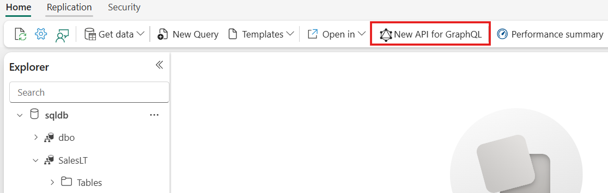Select **New** **API for GraphQL** from the
    toolbar.

3.  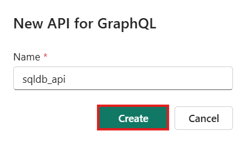Enter a **Name** for your item and
    select **Create**.

At this point, the API is ready but it's not exposing any data. APIs for
GraphQL are defined in a schema organized in terms of types and fields,
in a strongly typed system. Fabric automatically generates the necessary
GraphQL schema based on the data you choose to expose to GraphQL
clients.

1.  The **Choose data** screen allows you to search and choose the
    objects you want exposed in your GraphQL schema. Select the
    checkboxes next to the individual tables or stored procedures you
    want to expose in the API. To select all the objects in a folder,
    select the checkbox with the data source name at
    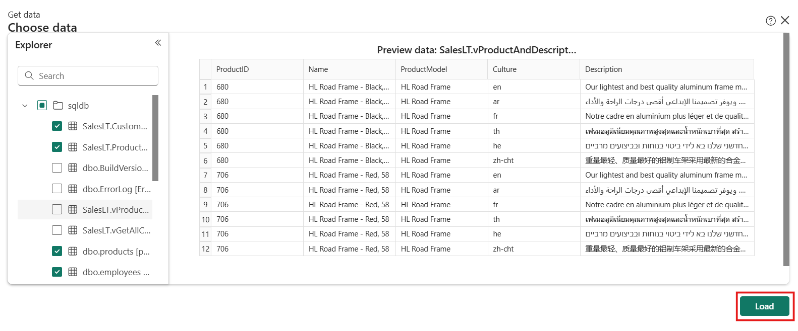the top.

2.  Select **Load** to start the GraphQL schema generation process.

3.  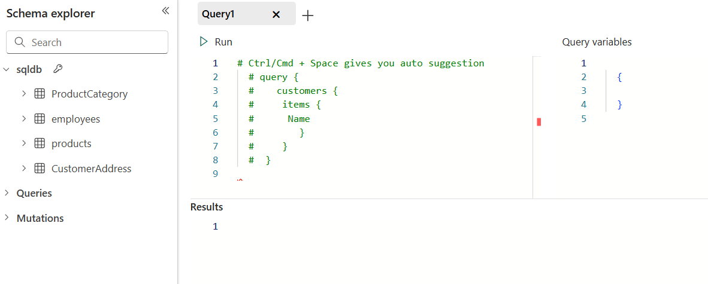The schema is generated, and you can start
    prototyping GraphQL queries (read, list) or mutations (create,
    update, delete) to interact with your data. The following image
    shows the **Schema explorer** with an API call template.

Your API for GraphQL is now ready to accept connections and requests.
You can use the API editor to test and prototype GraphQL queries and the
Schema explorer to verify the data types and fields exposed in the API.

## Exercise 8 – Create simple reports on your SQL database in Power BI 

1.  In order to navigate to the workspace page, click on the workspace
    name from the left menu.

> 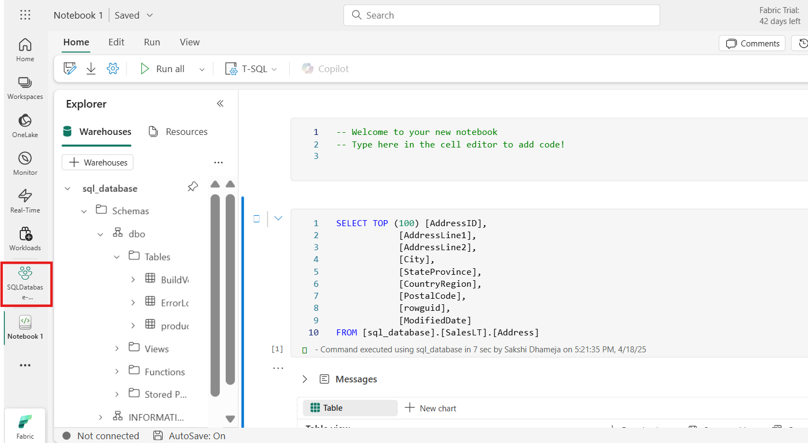

2.  Select the SQL analytics endpoint view of the database.

> 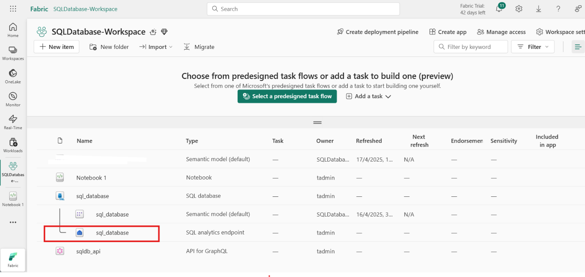

3.  Select the **Reporting** menu from
    the ribbon, then **New Report**.

4.  Choose **Continue** to create a new report with all available data.

5.  From the Customers table, check the
    checkbox of the column **CompanyName** for the report.

6.  Notice that as soon as you select the
    column, the data is displaying on the report area. Now, select the
    **EmailAddress** column.

7.  You can see **EmailAddress** data is
    also reflecting on the report area. Now, select FirstName as well.

8.  Similarly, select **FirstName**
    column as well and see the column added in the report.

9.  You now have a Power BI report of your SQL database data. Review the
    reports for accuracy.

## Conclusion

In conclusion, this lab provided a comprehensive experience in building
a SQL database within Microsoft Fabric, tailored for the AdventureWorks
sample data. From setting up the environment and enabling SQL
capabilities, to loading sample data, querying through SQL analytics
endpoints, and even creating GraphQL APIs and Power BI reports, each
step was designed to demonstrate the full potential of Fabric for data
management, analytics, and sharing. By following the detailed exercises,
users gain practical skills in modern data warehousing and reporting
workflows, enabling them to harness the power of Microsoft Fabric for
real-world data scenarios.
