# Use Case 2 – Build a Supply Chain Disruption Response App using Fabric Databases

By the end of this tutorial, you'll feel confident navigating Microsoft
Fabric's SQL features. You'll learn how to create and explore a
Lakehouse, understand the default datasets, and use the SQL endpoint to
perform basic SQL queries. The tutorial guides you through exploring
data with T-SQL, filtering records, performing aggregations, and
understanding schema structures—all within Microsoft Fabric's unified
analytics platform.

## ­Exercise 1 – Create a New Fabric Workspace

The objective is to create a new Fabric workspace. By the end,
participants will confidently set up, manage, and collaborate within
their own Fabric workspaces.

To create a workspace:

1.  From left pane, select **Workspaces** \> **New workspace**.

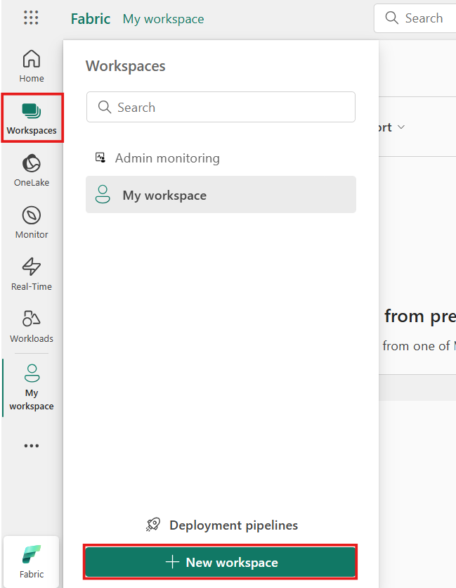

2.  The **Create a workspace** pane opens.

    - Give the workspace a unique name (mandatory).

    &nbsp;

    - Provide a description of the workspace (optional).

    &nbsp;

    - Assign the workspace to a domain (optional).

> 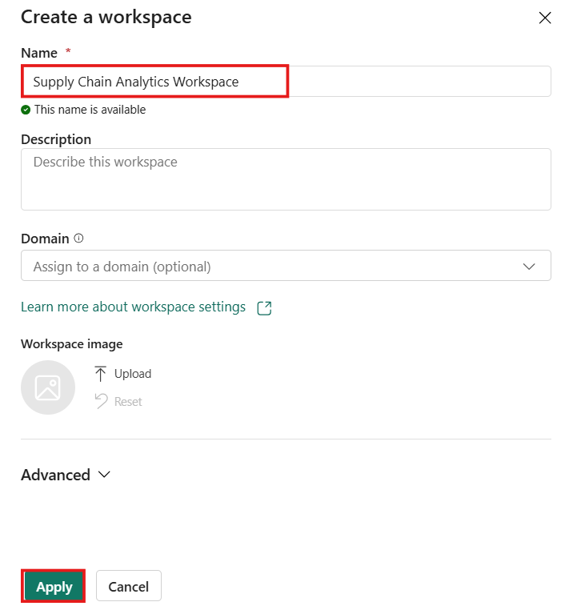If you are a domain contributor for the
> workspace, you can associate the workspace to a domain, or you can
> change an existing association.

3.  When done, either continue to the advanced settings, or
    select **Apply**.

## Exercise 2 – Create a SQL Database in Microsoft Fabric 

1.  Ensure you are in the Workspace you created earlier by selecting
    the **Workspaces** icon in the navigation bar, and then selecting
    the Workspace you created in the last step.

2.  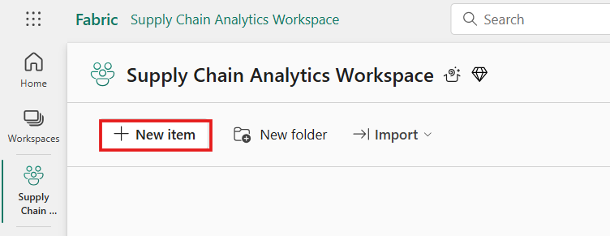Create a Fabric SQL database by selecting
    the **+ New item**.

3.  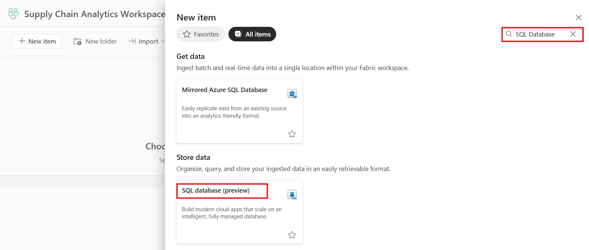In the **New Item | All Items** panel, scroll
    to the **Store Data** area and select **SQL database (preview)**.

4.  Fill in the **Name** field with the
    text ***supply_chain_analytics_database*** and select
    the **Create** button. Database creation should take less than a
    minute.

> 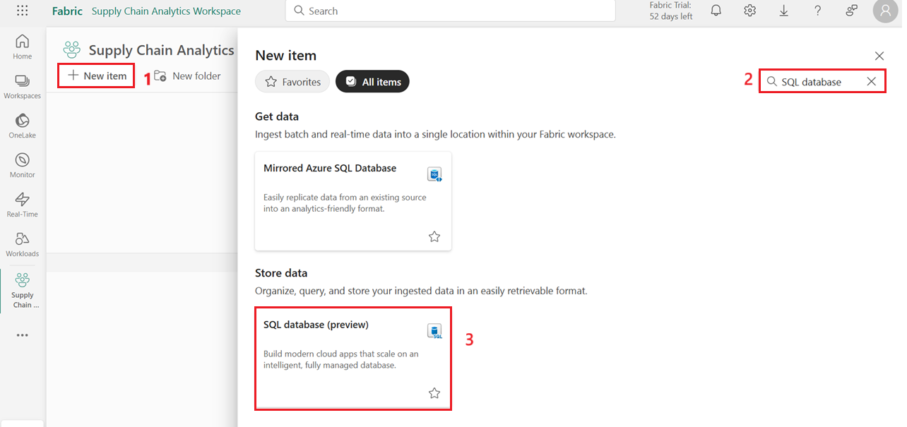

## Exercise 3 – Ingest sample data and create objects and data 

### **Task-1: Open the Query Editor in the Fabric Portal**

1.  The Query Editor will be displayed
    that is loaded with the schema.

2.  Select the **Sample data **button. This takes a few moments to
    populate your tutorial database with the SalesLT sample data.

3.  Check the Notifications area to ensure the import is complete before
    you proceed.

4.  Notifications show you when the import of the sample data is
    complete. Your SQL database in Fabric now contains
    the SalesLT schema and associated tables.

### **Task-2: Use the SQL database in the SQL Editor (Copilot)**

1.  In your database view, start by selecting **New Query** from the
    icon bar. This brings up a query editor.

> Type a T-SQL comment at the top of the
> query, such as -- Create a query that shows the total number of
> customers and press **Enter**. You get a result similar to this one:

2.  Pressing the "Tab" key implements the
    suggested code:

3.  Select **Explain query** in the icon
    bar of the Query editor to insert comments in your code to explain
    each major step:

In a production environment, you might have data that is already in a
normalized format for day-to-day application operations, which you have
simulated here with the *SalesLT* data. As you create a query, it's
saved automatically in the **Queries** item in the **Explorer** pane.

You should see your query as "SQL query 1". By default, the system
numbers the queries like "SQL query 1", but you can select the ellipses
next to the query name to duplicate, rename or delete the query.

> 

### **Task-3: Insert data using Transact-SQL**

The following steps use a T-SQL script to create a schema, table, and
data for the simulated data for supply chain analysis.

1.  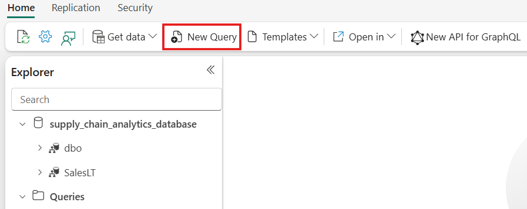Select the **New Query** button in the
    toolbar of the SQL database to create a new query.

2.  Paste the following script in the Query area and select **Run** to
    execute it. The following T-SQL script:

    1.  Creates a schema named SupplyChain.

    &nbsp;

    1.  Creates a table named SupplyChain.Warehouse.

    &nbsp;

    1.  Populates the SupplyChain.Warehouse table with some randomly
        created product data from SalesLT.Product.

**SQL**

/\* Create the Tutorial Schema called SupplyChain for all tutorial
objects \*/

CREATE SCHEMA SupplyChain;

GO

/\* Create a Warehouse table in the Tutorial Schema

NOTE: This table is just a set of INT's as Keys,

tertiary tables will be added later

\*/

CREATE TABLE SupplyChain.Warehouse (

ProductID INT PRIMARY KEY -- ProductID to link to Products and Sales
tables

, ComponentID INT -- Component Identifier, for this tutorial we assume
one per product, would normalize into more tables

, SupplierID INT -- Supplier Identifier, would normalize into more
tables

, SupplierLocationID INT -- Supplier Location Identifier, would
normalize into more tables

, QuantityOnHand INT); -- Current amount of components in warehouse

GO

/\* Insert data from the Products table into the Warehouse table.
Generate other data for this tutorial \*/

INSERT INTO SupplyChain.Warehouse (ProductID, ComponentID, SupplierID,
SupplierLocationID, QuantityOnHand)

SELECT p.ProductID,

ABS(CHECKSUM(NEWID())) % 10 + 1 AS ComponentID,

ABS(CHECKSUM(NEWID())) % 10 + 1 AS SupplierID,

ABS(CHECKSUM(NEWID())) % 10 + 1 AS SupplierLocationID,

ABS(CHECKSUM(NEWID())) % 100 + 1 AS QuantityOnHand

FROM \[SalesLT\].\[Product\] AS p;

GO

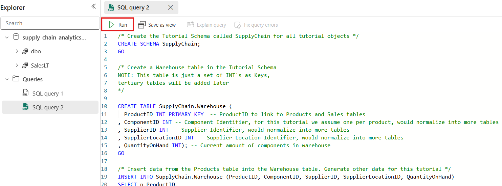

> Your SQL database in Fabric database now includes Warehouse
> information. You'll use this data in a later step in this tutorial.

3.  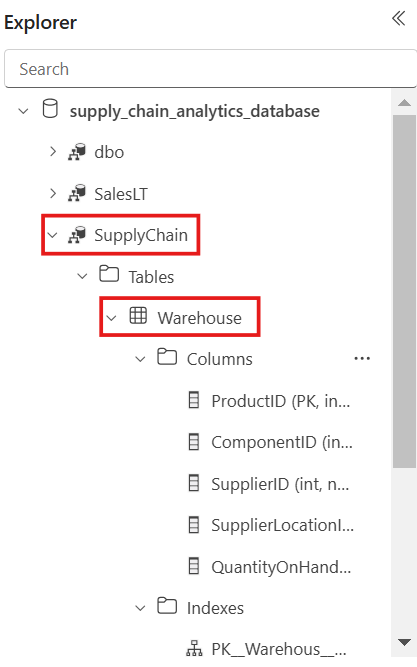You can select these tables in
    the **Explorer** pane, and the table data is displayed – no need to
    write a query to see it.

### **Task-4: Insert data using a Microsoft Fabric Pipeline**

Another way you can import data into and export data out of your SQL
database in Fabric is to use a Microsoft Fabric Data Pipeline. Data
pipelines offer an alternative to using commands, instead using a
graphical user interface. A data pipeline is a logical grouping of
activities that together perform a data ingestion task. Pipelines allow
you to manage extract, transform, and load (ETL) activities instead of
managing each one individually.

Microsoft Fabric Pipelines can contain a Dataflow. **Dataflow
Gen2** uses a Power Query interface that allows you to perform
transformations and other operations on the data. You'll use this
interface to bring in data from the *Northwind Traders* company, which
Contoso partners with. They're currently using the same suppliers, so
you'll import their data and show the names of these suppliers using a
view that you'll create in another step in this tutorial.

To get started, open the SQL database view of the sample database in the
Fabric portal,

1.  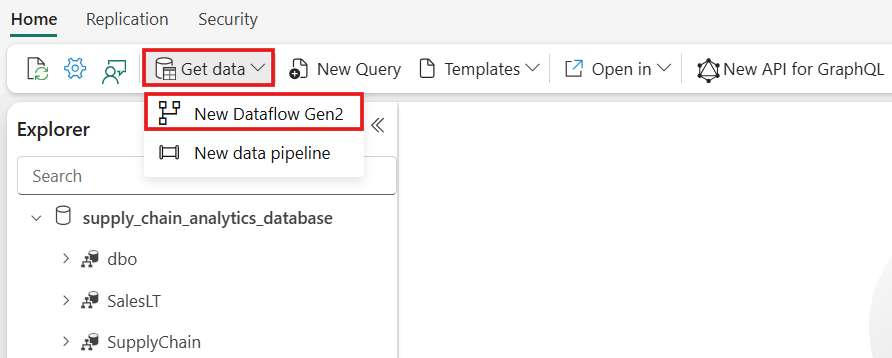Select the **Get Data** button from the menu
    bar and Select **New Dataflow Gen2**.

2.  In the Power Query view, select the **Get Data** button. This starts
    a guided process rather than jumping to a particular data area.

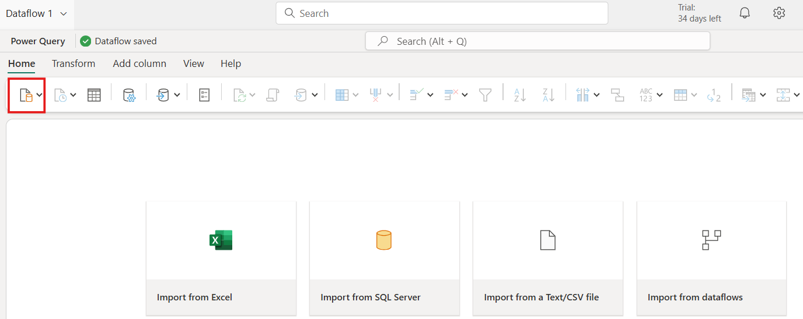

3.  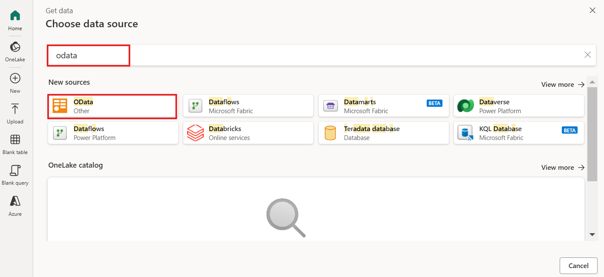In the search box of the **Choose Data
    Source**, view type **odata** and Select **OData** from the **New
    sources** results.

4.  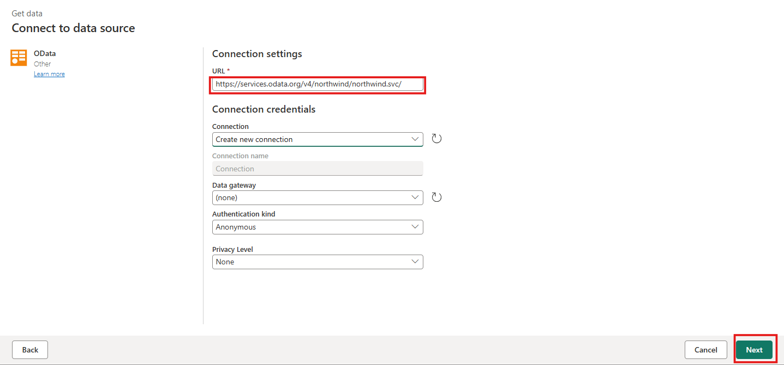In the URL text box of the **Connect to data
    source** view, type the
    text: *https://services.odata.org/v4/northwind/northwind.svc/* for
    the Open Data feed of the Northwind sample database. Select
    the **Next** button to continue.

5.  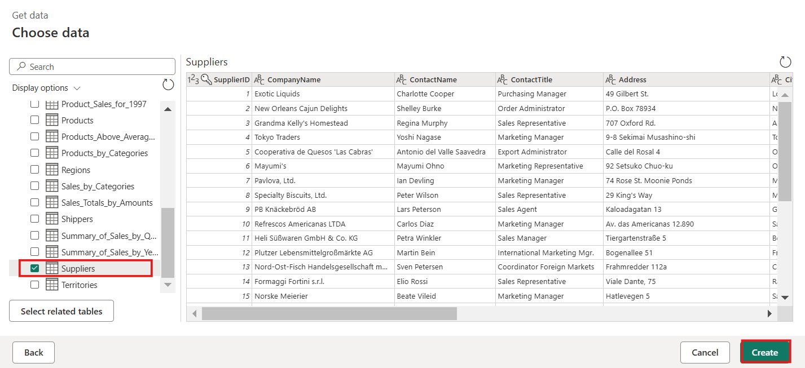Scroll down to the **Suppliers** table from
    the OData feed and select the checkbox next to it. Then select
    the **Create** button.

6.  Select the **+** plus-symbol next to the **Data
    Destination** section of the **Query Settings**, and select **SQL
    database** from the list.

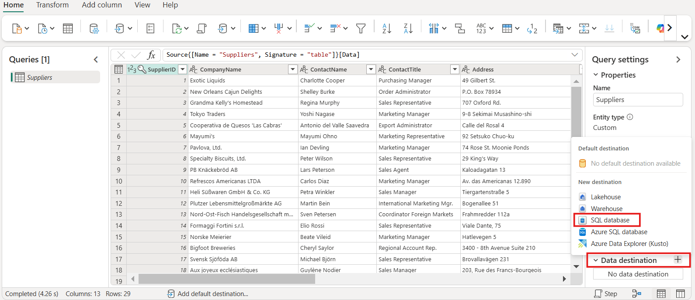

7.  On the **Connect to data destination** page, ensure
    the **Authentication kind** is set to **Organizational account**.
    Select **Sign in** and enter your Microsoft Entra ID credentials to
    the database.

> 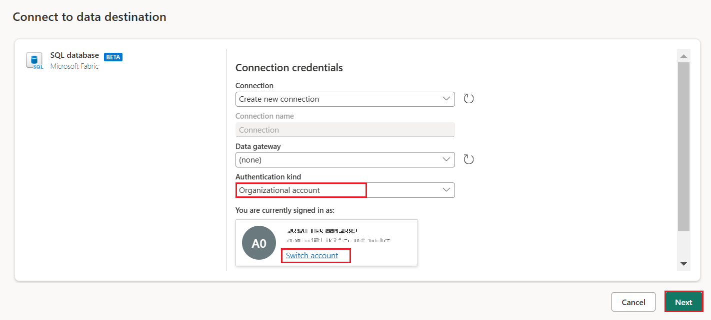Once you're successfully connected, select
> the **Next** button.

8.  Select the Workspace name you created in the first step of this
    tutorial in the **Choose destination target** section.

> Select your database that shows underneath it. Ensure that the **New
> table** radio button is selected and leave the name of the table
> as **Suppliers** and select the **Next** button.
>
> 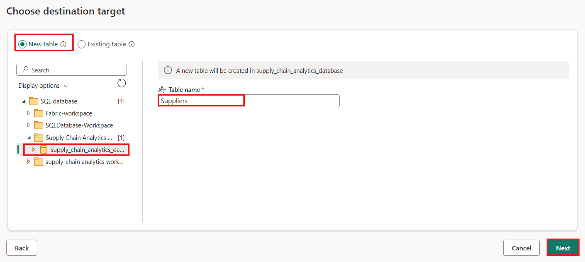

9.  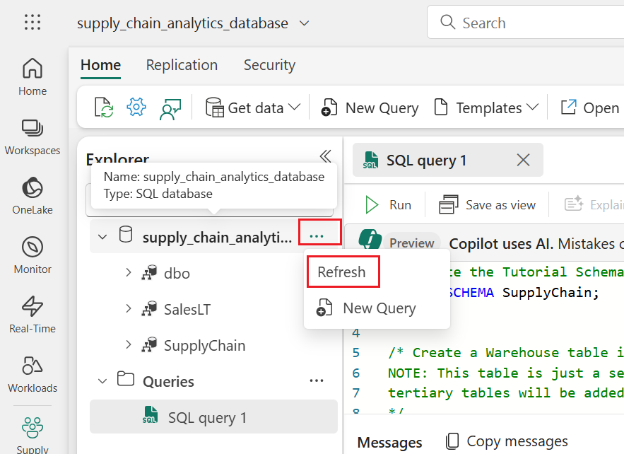Leave the **Use automatic settings** slider
    set on the **Choose destination settings** view and select
    the **Save settings** button.

10. Select the **Publish** button to start the data transfer.

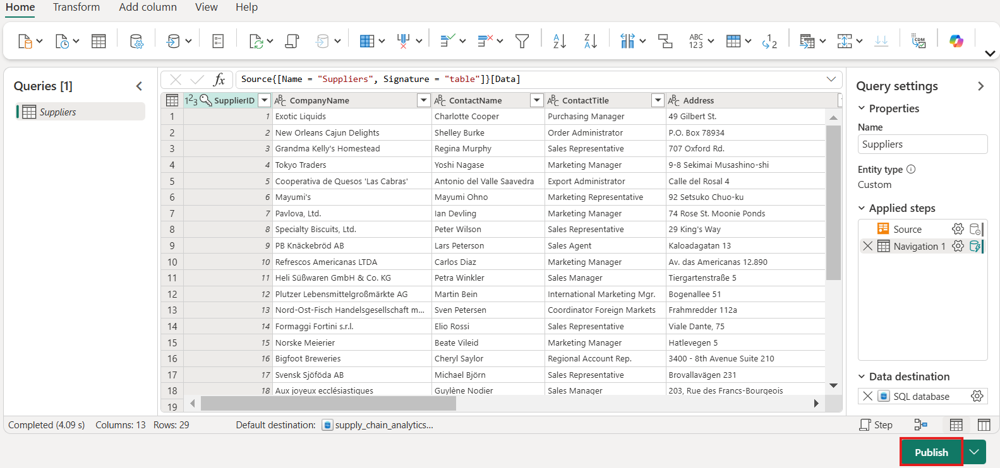

11. 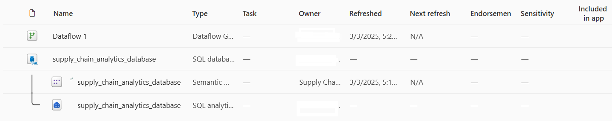You're returned to your Workspace view,
    where you can find the new Dataflow item.

12. 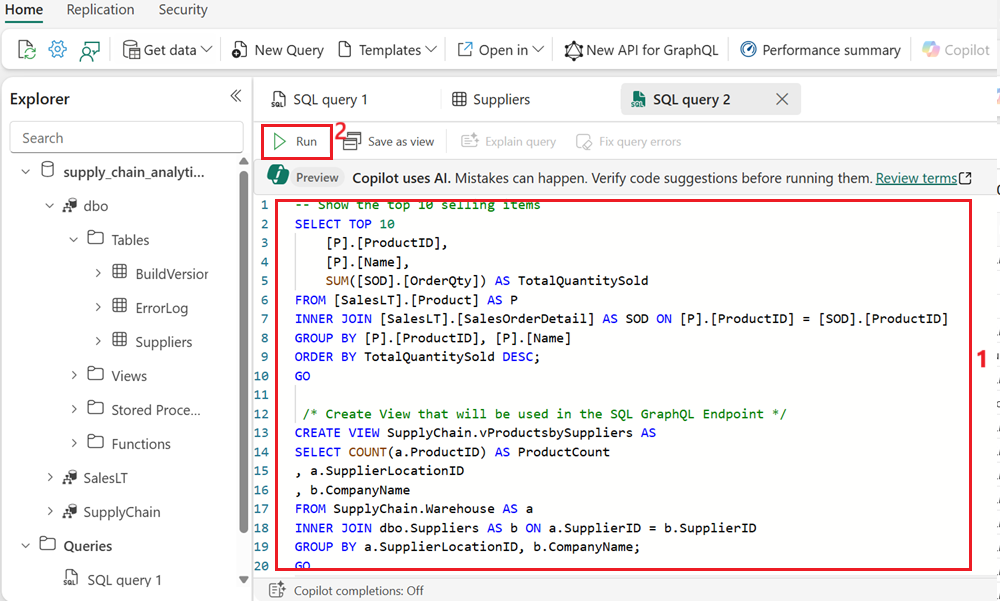When the **Refreshed** column shows the
    current date and time, you can select your database name in
    the **Explorer** then expand the dbo schema to show the new table.
    (You might have to select the **Refresh** icon in the toolbar.)

The data is now ingested into your database. You can now create a query
that combines the data from the Suppliers table using this tertiary
table.

## Exercise 4 – Query the database 

### **Task-1: Transact-SQL Queries**

You can type Transact-SQL (T-SQL) statements in a query window.

1.  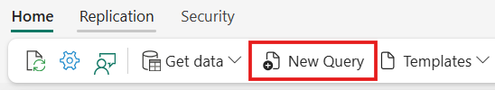In ribbon of the database in the Fabric
    portal, select the **New Query** button.

2.  Copy the following T-SQL script and paste it in the query window.
    This sample script performs a simple **TOP 10** query, and creates a
    view based on a simple analytical T-SQL query. The new
    view **SupplyChain.vProductsbySuppliers** will be used later in this
    tutorial.

> Select the **Run** button in the toolbar to execute the T-SQL query.

**SQL**

-- Show the top 10 selling items

SELECT TOP 10

\[P\].\[ProductID\],

\[P\].\[Name\],

SUM(\[SOD\].\[OrderQty\]) AS TotalQuantitySold

FROM \[SalesLT\].\[Product\] AS P

INNER JOIN \[SalesLT\].\[SalesOrderDetail\] AS SOD ON
\[P\].\[ProductID\] = \[SOD\].\[ProductID\]

GROUP BY \[P\].\[ProductID\], \[P\].\[Name\]

ORDER BY TotalQuantitySold DESC;

GO

/\* Create View that will be used in the SQL GraphQL Endpoint \*/

CREATE VIEW SupplyChain.vProductsbySuppliers AS

SELECT COUNT(a.ProductID) AS ProductCount

, a.SupplierLocationID

, b.CompanyName

FROM SupplyChain.Warehouse AS a

INNER JOIN dbo.Suppliers AS b ON a.SupplierID = b.SupplierID

GROUP BY a.SupplierLocationID, b.CompanyName;

GO

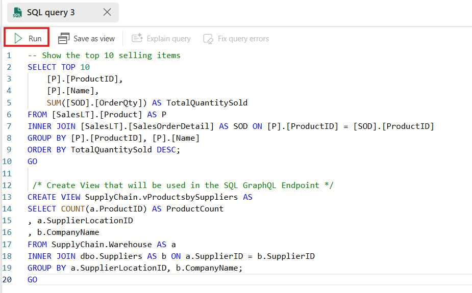

3.  You can select the ellipses (...) next to the name under the Object
    View to duplicate, rename, or delete it.

4.  The desired results will be displayed based
    on the query.

### **Task-2: Performance Monitoring in SQL database in Fabric**

As your queries run in your SQL database in Fabric, the system collects
performance metrics to display in the **Performance Dashboard**. You can
use the Performance Dashboard to view database performance metrics, to
identify performance bottlenecks, and find solutions to performance
issues.

- 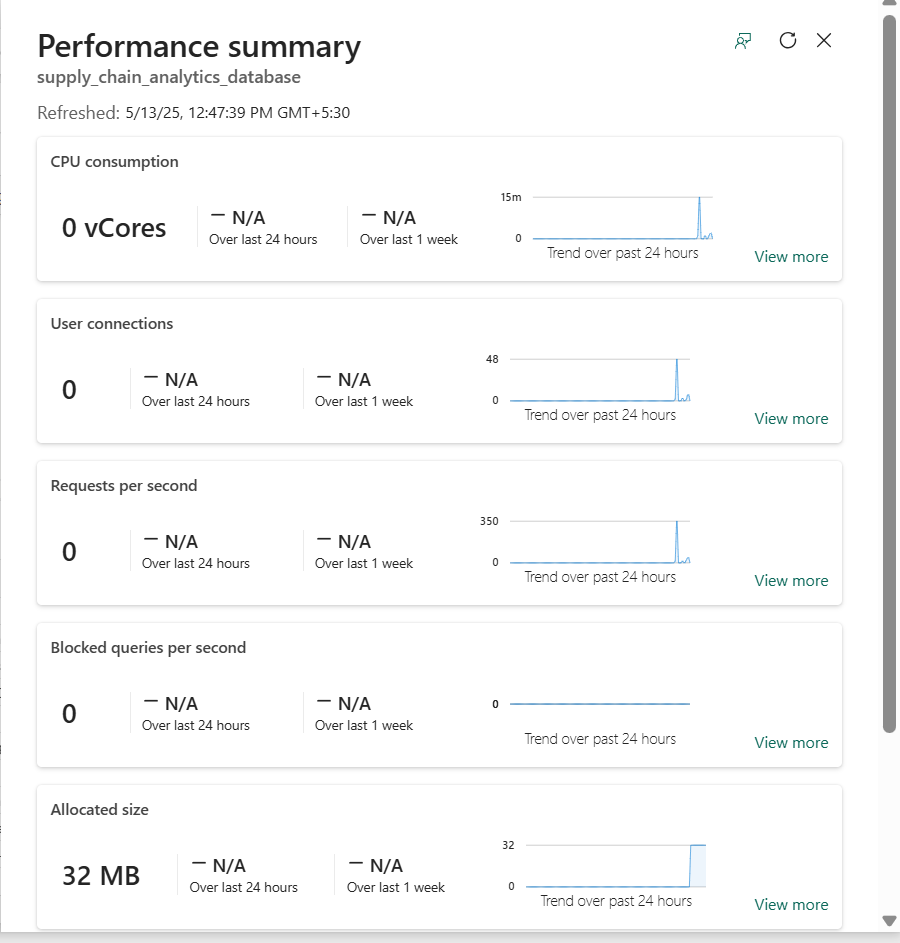On the **Home** toolbar in the Query with the
  SQL query editor, select **Performance summary**.

- The entire performance summary is displayed such as CPU consumption,
  Allocated size, User connections etc.

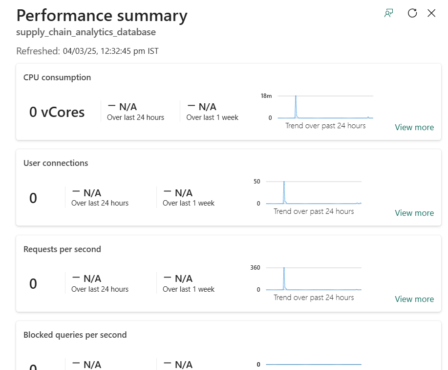

### **Task-3: Backups in SQL database in Fabric** 

SQL database in Fabric automatically takes backups for you, and you can
see these backups in the properties that you access through the database
view of the Fabric portal.

1.  Open your database view in the Fabric portal and select the Settings
    icon in the toolbar.

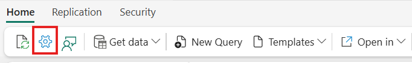

2.  Select the **Restore points** page. This view shows the recent point
    in time backups that have been taken on your database.

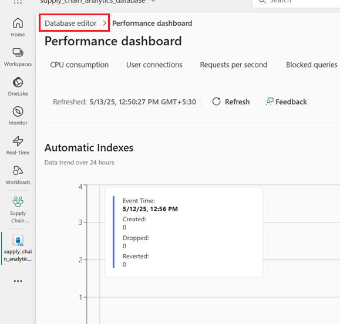

### **Task-4: Security in SQL database in Fabric** 

You'll now grant access to another account in your organization and then
control their database securables using Schemas.

1.  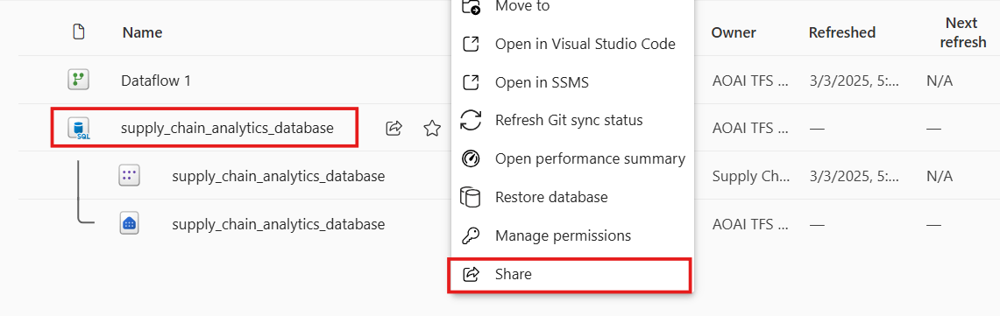From your Fabric Workspace, select the
    context menu (...) of the SQL database, then select **Share** from
    the menu.

2.  Enter a contact name from your organization to receive the sharing
    invitation notification and Select **Grant**.

> You don't need to grant any further permissions in this area – sharing
> the database to the account gives the sharing contact access to
> connect.
>
> 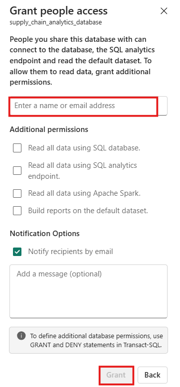

3.  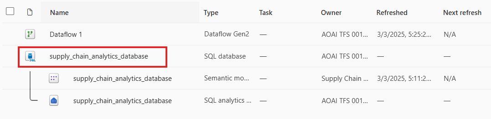Open the SQL database by selecting on it in
    the workspace view.

4.  Select **Security** in the menu bar of the database view.
    Select **Manage SQL security** in the ribbon.

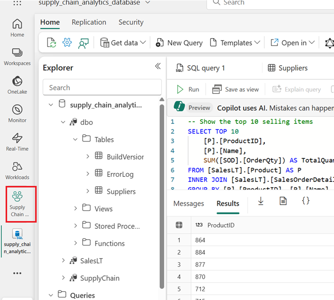

5.  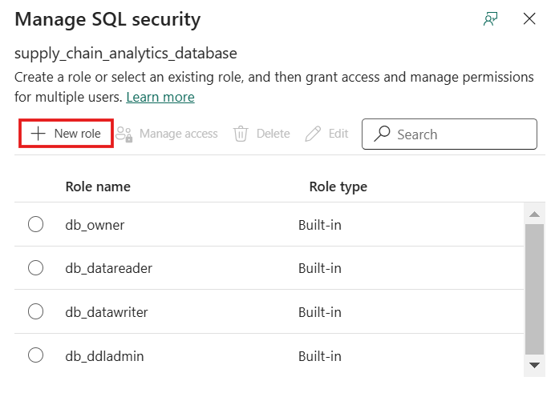In this panel, you can select a current
    database role to add accounts to it. Select the **+ New role** item.

6.  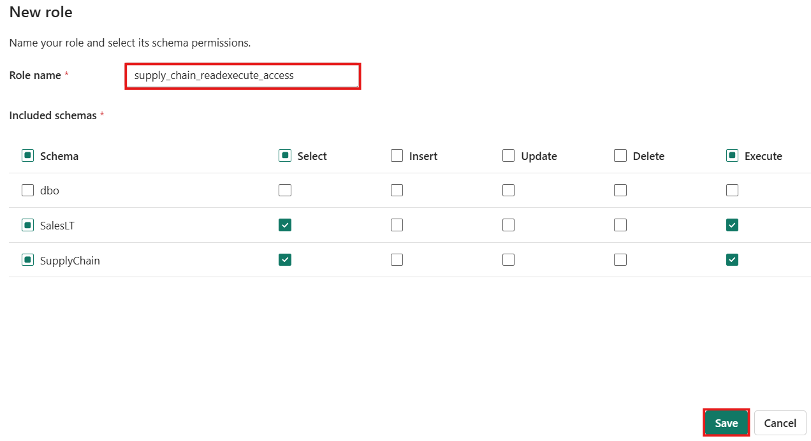Name the
    role **supply_chain_readexecute_access** and then select
    the SalesLT and SupplyChain schemas. De-select all checkboxes
    except **Select** and **Execute**. Select **Save**.

7.  In the **Manage SQL security** panel, select the radio-box next to
    the new role, and select **Manage access** in the menu.

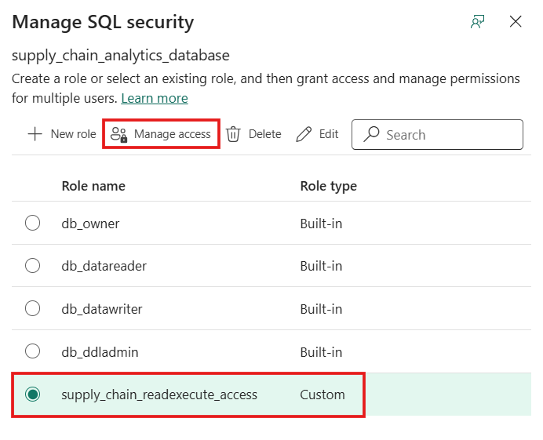

8.  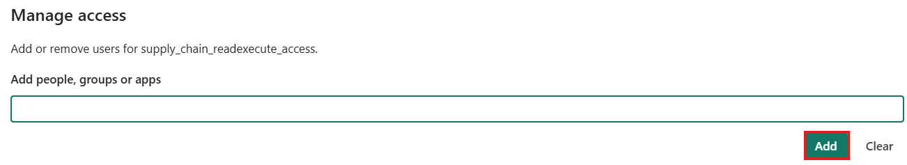Enter the name of the account in your
    organization you shared the database to and select
    the **Add** button, and then select **Save**.

You can allow the account to view data and run stored procedures in the
database with the combination of: the Share action, and granting the
role both SELECT and EXECUTE permissions on the two schemas.

## Exercise 5 – Use the SQL analytics endpoint to query data 

### **Task-1: Query the data with the SQL analytics endpoint** 

You can query any of the mirrored data in the SQL analytics endpoint
using standard Transact-SQL statements that are compatible with a Fabric
warehouse. 

1.  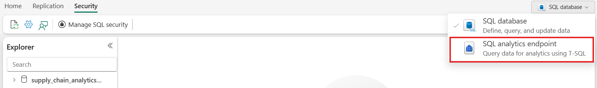You can access the SQL analytics endpoint in
    the **database view**.

2.  In this step, create a view over the mirrored data, and then create
    a report to show the results.

> 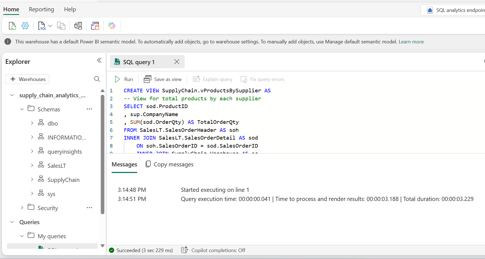Ensure you're in the SQL analytics endpoint,
> and then open a new Query window using the icon bar that depicts a
> paper with the letters **SQL** and paste the following Transact-SQL
> Code and select **Run** to execute it.

CREATE VIEW SupplyChain.vProductsBySupplier AS

-- View for total products by each supplier

SELECT sod.ProductID

, sup.CompanyName

, SUM(sod.OrderQty) AS TotalOrderQty

FROM SalesLT.SalesOrderHeader AS soh

INNER JOIN SalesLT.SalesOrderDetail AS sod

ON soh.SalesOrderID = sod.SalesOrderID

INNER JOIN SupplyChain.Warehouse AS sc

ON sod.ProductID = sc.ProductID

INNER JOIN dbo.Suppliers AS sup

ON sc.SupplierID = sup.SupplierID

GROUP BY sup.CompanyName, sod.ProductID;

GO

CREATE VIEW SupplyChain.vSalesByDate AS

-- Product Sales by date and month

SELECT YEAR(OrderDate) AS SalesYear

, MONTH(OrderDate) AS SalesMonth

, ProductID

, SUM(OrderQty) AS TotalQuantity

FROM SalesLT.SalesOrderDetail AS SOD

INNER JOIN SalesLT.SalesOrderHeader AS SOH

ON SOD.SalesOrderID = SOH.SalesOrderID

GROUP BY YEAR(OrderDate), MONTH(OrderDate), ProductID;

GO

CREATE VIEW SupplyChain.vTotalProductsByVendorLocation AS

-- View for total products by each supplier by location

SELECT wh.SupplierLocationID AS 'Location'

, vpbs.CompanyName AS 'Supplier'

, SUM(vpbs.TotalOrderQty) AS 'TotalQuantityPurchased'

FROM SupplyChain.vProductsBySupplier AS vpbs

INNER JOIN SupplyChain.Warehouse AS wh

ON vpbs.ProductID = wh.ProductID

GROUP BY wh.SupplierLocationID, vpbs.CompanyName;

GO

**SQL**

3.  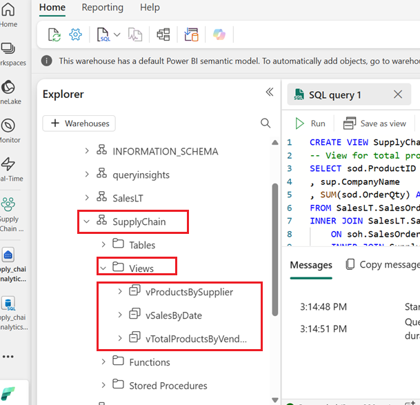This T-SQL query creates three new SQL
    views,
    named **SupplyChain.vProductsBySupplier**, **SupplyChain.vSalesByDate**,
    and **SupplyChain.vTotalProductsByVendorLocation**.

You can now use these views in analytics and reporting. You will create
a report using these views in the further steps.

## Exercise 6 – Create and share visualizations.

### **Task-1: Find the connection strings to the SQL database.**

1.  To get your server and database name, open your SQL database in
    Fabric portal view and select the **Settings** button in the icon
    bar.

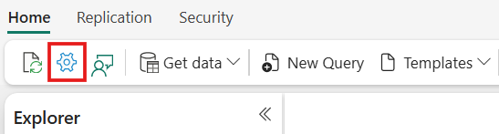

2.  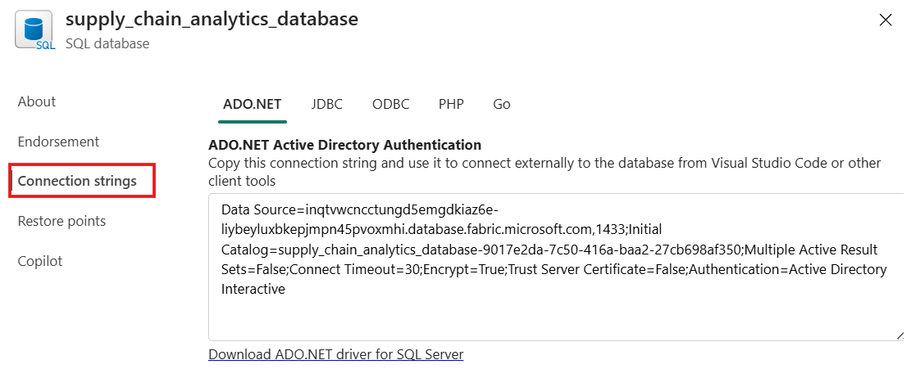Select **Connection Strings** and you'll see
    a long string that starts with **Data Source...** From there, select
    the text between the characters **tcp:** through the
    characters **,1433**. Ensure that you select the entire set of
    characters there and nothing more for the server name.

3.  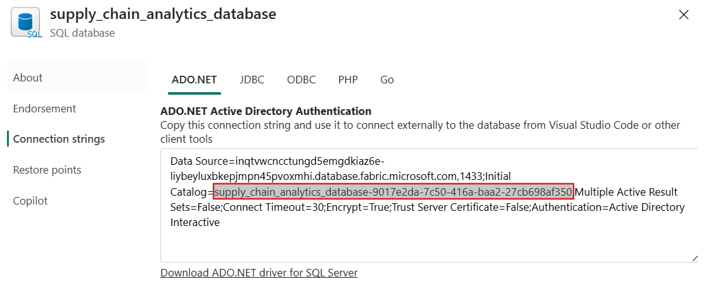For the database name, select all the
    characters between the characters **Initial
    Catalog=** and **;MultipleActiveResultSets**.

You can now use these SQL strings in your connection area for tools such
as Power BI or SQL Server Management Studio. For Visual Studio Code with
the mssql extension, you can paste the entire connection string in the
first text box where you make a database connection, so you don't have
to select only the server and database names.

### **Task-2: Power BI visualization creation**

As you work with the SQL analytics endpoint, it creates a Data model of
the assets. This is an abstracted view of your data and how it's
displayed and the relationship between entities. Some of the defaults
the system takes might not be as you desire, so you'll now change one
portion of the data model for this SQL analytics endpoint to have a
specific outcome.

1.  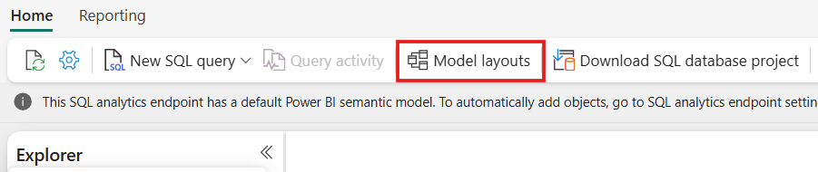In your SQL analytics endpoint view, select
    the **Model layouts** button in the ribbon.

2.  From the resulting view, zoom in and scroll over until you see
    the **vTotalProductsByVendorLocation** object. Select it.

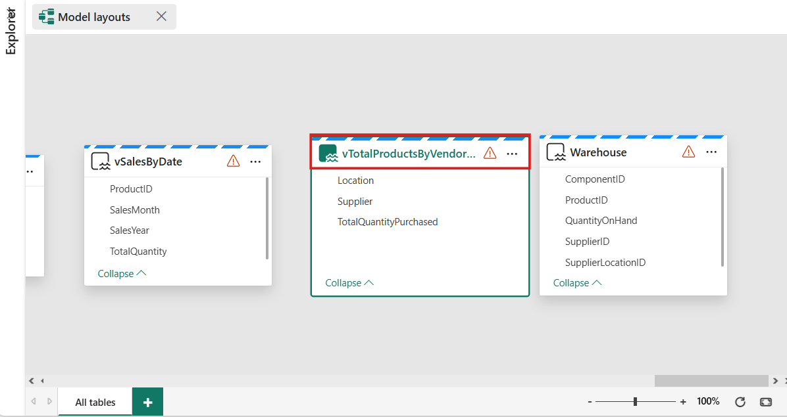

3.  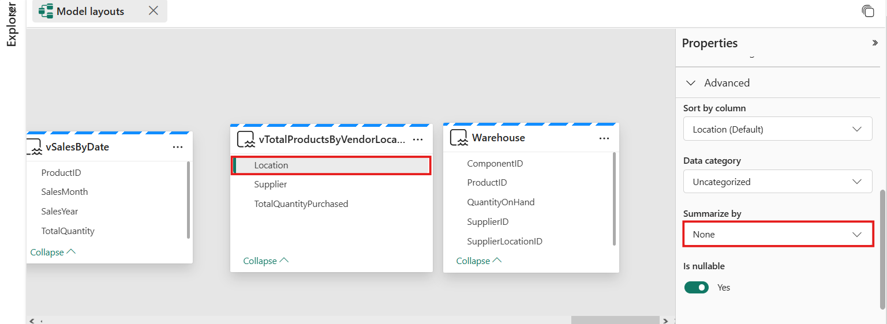In the properties, select
    the **Location** field, and expand the **Advanced** properties
    section. You might need to scroll to find it. Set the value
    of **Summarize by** to **None**. This ensures that when the field is
    used, it's a discrete number, not a mathematical summarization of
    that number.

### **Task-3: Create a report**

Here, the task is to create a report based on the views you created in
the SQL analytics endpoint in previous steps.

1.  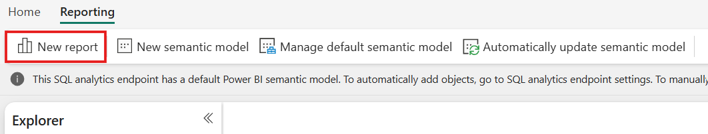Inside the SQL analytics endpoint view,
    select the **Reporting** button in the menu bar and then the **New
    report** button in the ribbon.

2.  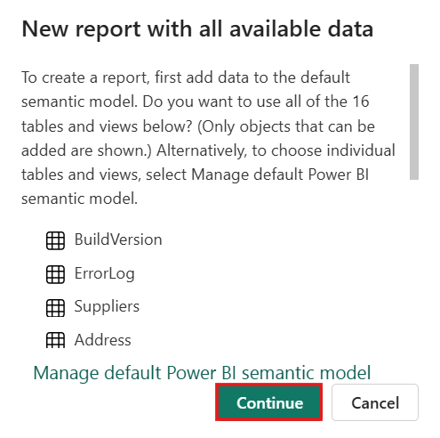From the **New report with all available
    data** that appears, select the **Continue** button.

3.  The Power BI canvas appears, and you're presented with the option to
    use the Copilot to create your report. Feel free to explore what
    Copilot can come up with. For the rest of this tutorial, we'll
    create a new report with objects from earlier steps.

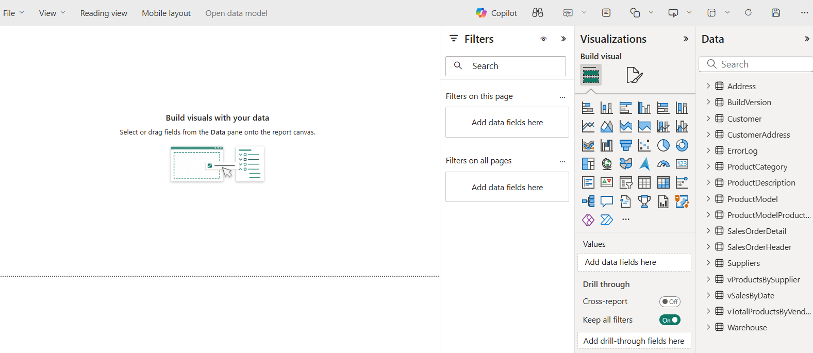

4.  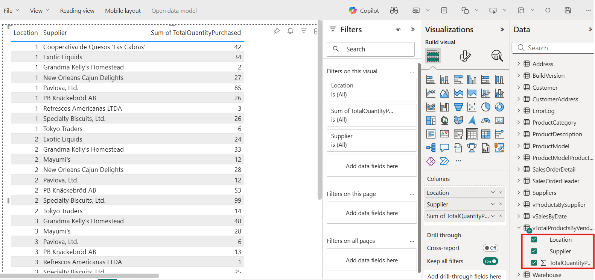Expand the **vTotalProductsByVendor** data
    object. Select each of the fields you see there. The report takes a
    moment to gather the results to a text view. You can size this text
    box if desired.

5.  Select in a blank area of the report canvas, and then
    select **Location** in the **Data** fields area.

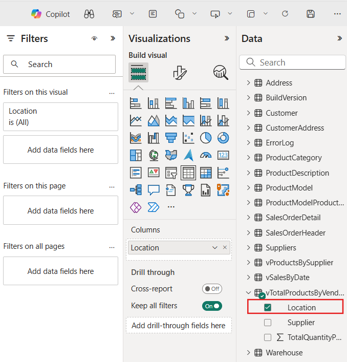

6.  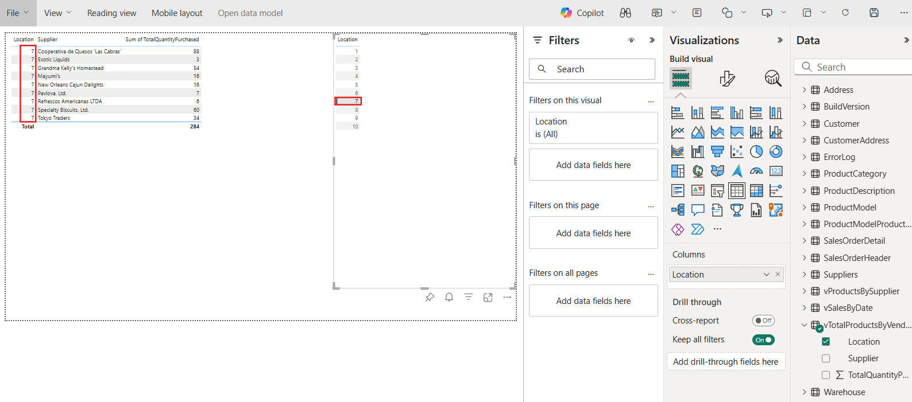Select a value in the box you just created –
    notice how the first selection of values follows the selection you
    make in the second box. Select that same value again to clear the
    selection.

7.  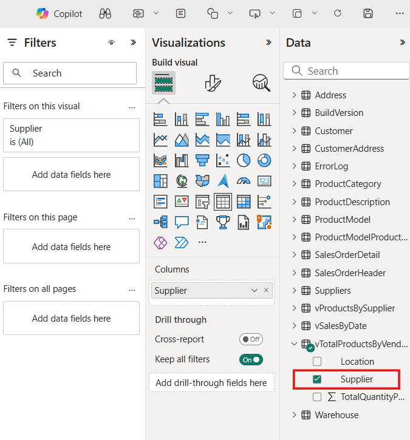Select in a blank area of the reporting
    canvas, and then select the **Supplier** field.

8.  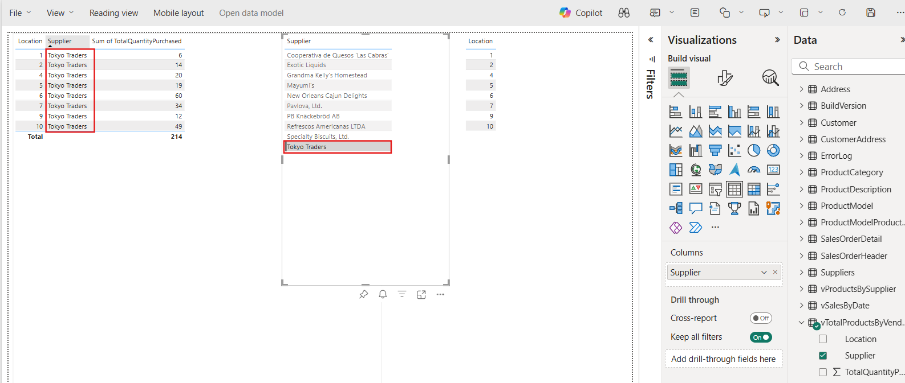Once again, you can select the name of a
    supplier and the first selection shows the results of just that
    supplier.

### **Task-4: Save the Power BI item for sharing** 

You can save and share your report with other people in your
organization.

1.  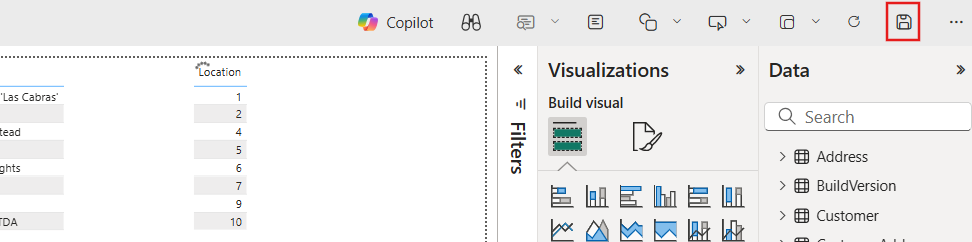Select the **Save** button in the icon box.

2.  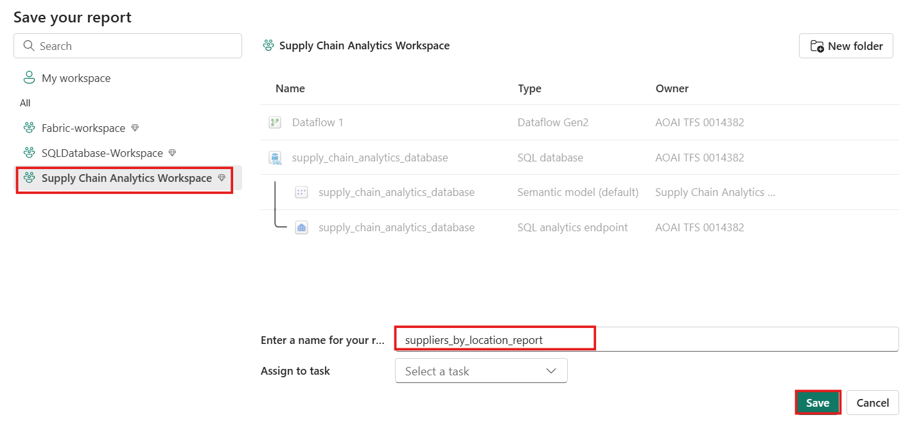Name the
    report **suppliers_by_location_report**, and ensure you select the
    correct Workspace for this tutorial.

3.  Select the **Share** button in the icon bar to share the report with
    people in your organization who have access to the proper data
    elements.

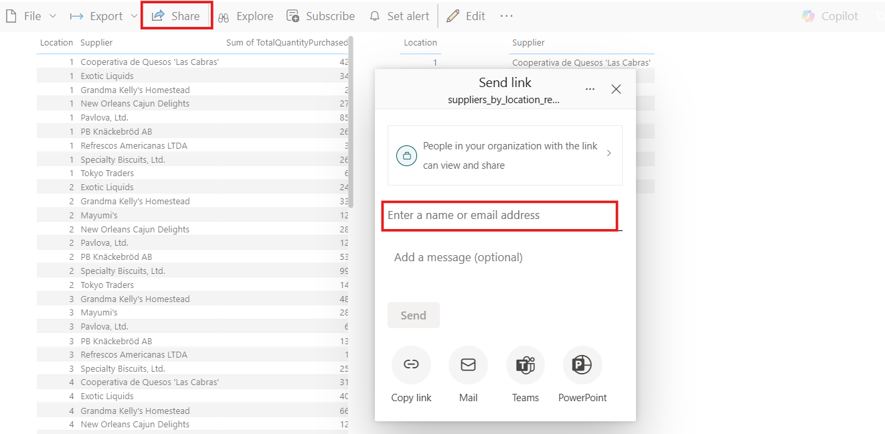

## Exercise 7 – Perform data analysis using Microsoft Fabric Notebooks

### **Task-1: Data analysis with T-SQL notebooks**

1.  Navigate to the Workspace you created for this tutorial from the
    Home of your Microsoft Fabric portal. Select the **New Item** button
    in the tool bar.

> 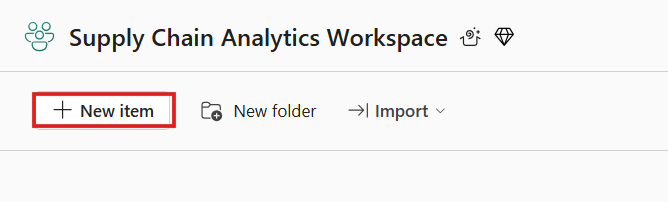

2.  Select **All items** and scroll until you see a **Notebook** item.
    Select that item to create a new Notebook.

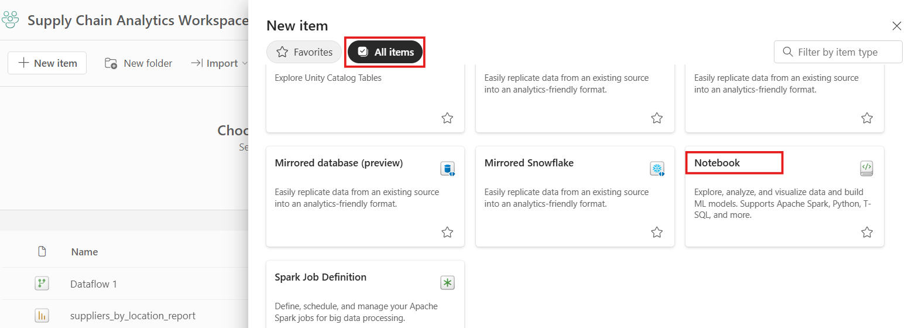

3.  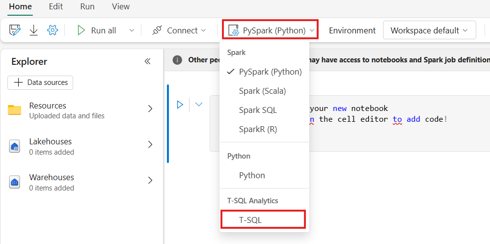In the icon bar, change the environment
    from **PySpark (Python)** to **T-SQL**.

4.  In each code cell, there is a drop-down list for the code language.
    In the first cell in the Notebook, change the code language
    from **PySpark (Python)** to **T-SQL**.

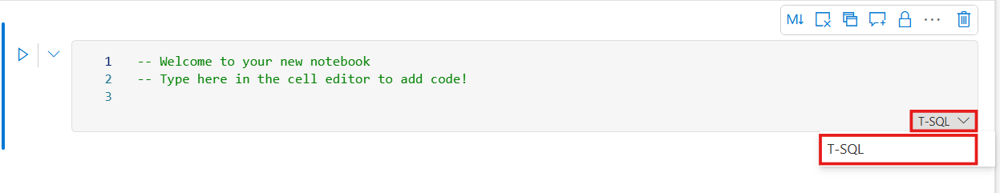

5.  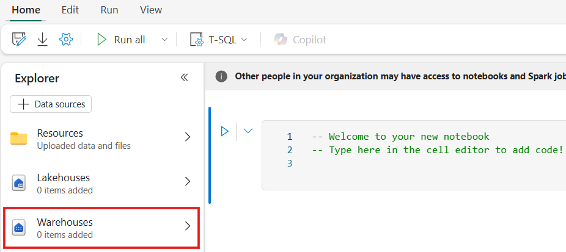In the Notebook **Explorer**, select
    the **Warehouses** item.

6.  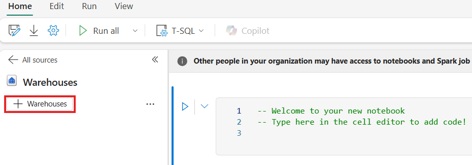Select the **+ Warehouses** button.

7.  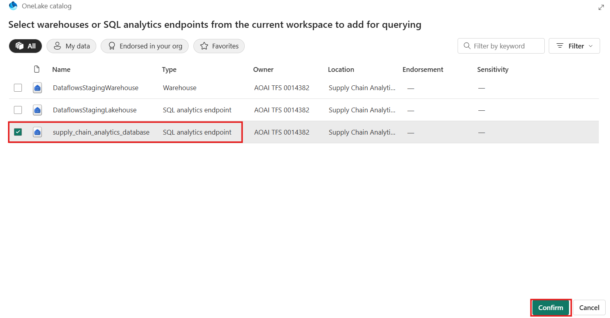Select the **SQL analytics endpoint** object
    that is named supply_chain_analytics_database, with the same name of
    the object you created earlier in this tutorial. Select **Confirm**.

8.  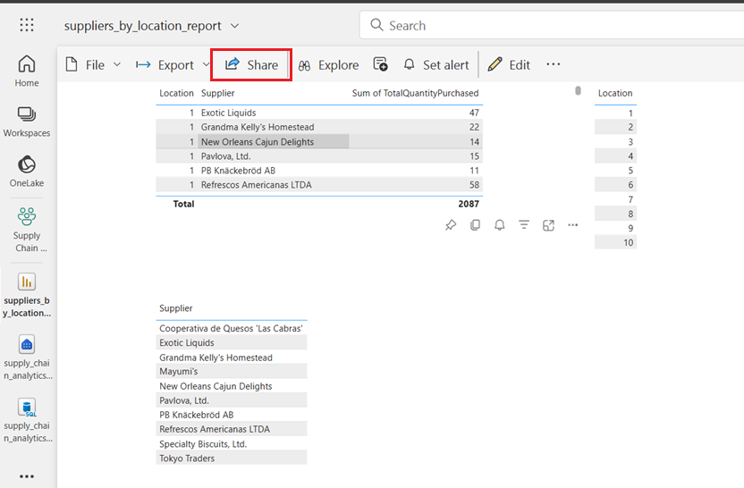Expand the database, expand **Schemas**.
    Expand the **SupplyChain** schema. Expand **Views**, and locate the
    SQL view named **vProductsBySupplier**.

9.  Select the ellipses next to that view. and select the option that
    says SELECT TOP 100.

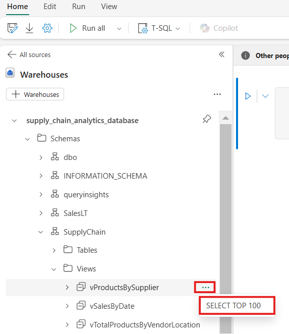

10. 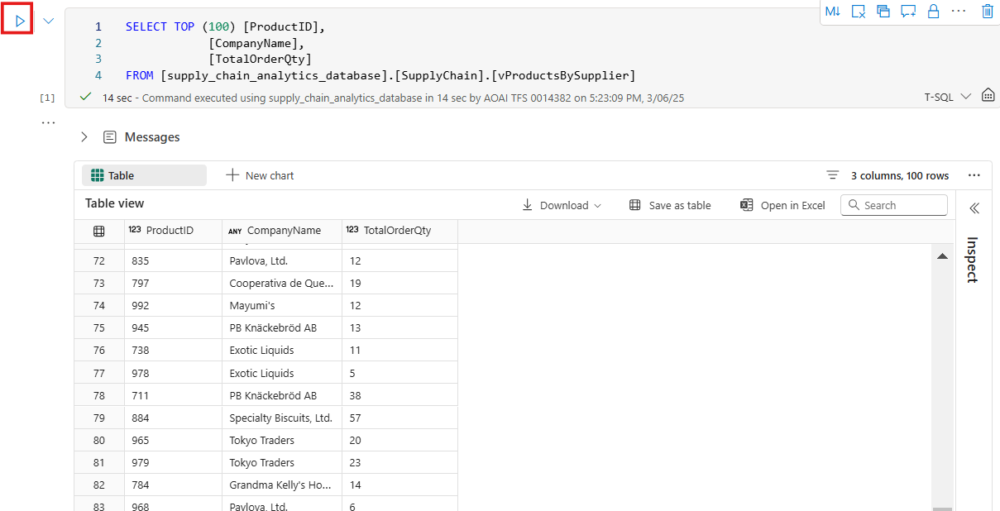This creates a cell with T-SQL code that has
    the statements pre-populated for you. Select the **Run Cell** button
    for the cell to run the query and return the results.

11. 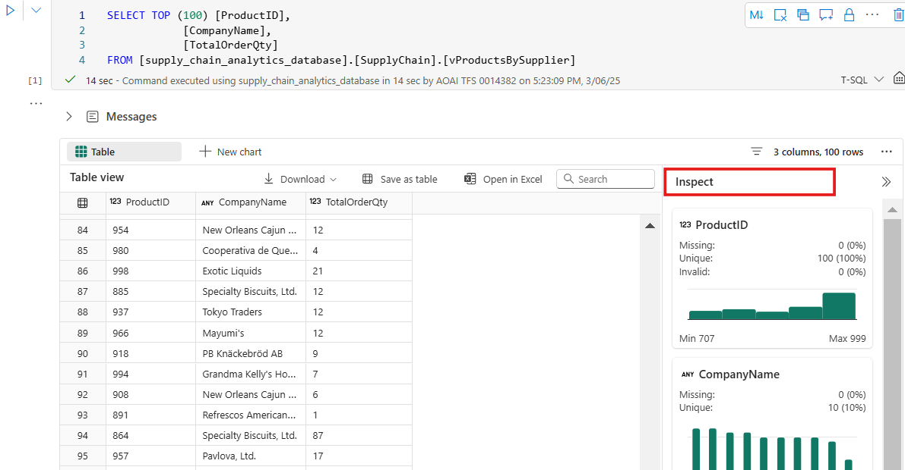In the results, you can see not only the
    data requested, but buttons that allow you to view charts, save the
    data as another table, download, and more. To the side of the
    results you can see a new pane with quick inspection of the data
    elements, showing minimum and maximum values, missing data, and
    unique counts of the data returned.

12. 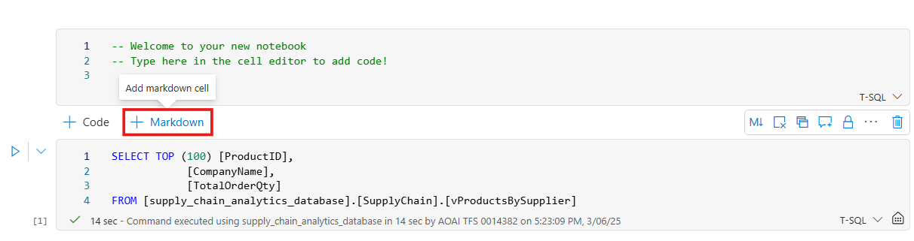Hovering between the code cells shows you a
    menu to add another cell. Select the **+ Markdown** button

13. 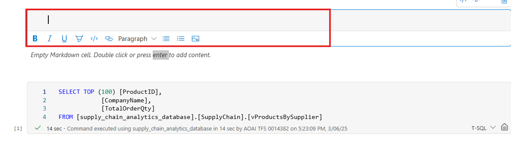This places a text-based field where you can
    add information. Styling for the text is available in the icon bar,
    or you can select the \</\> button to work with Markdown directly.
    The result of the formatting show as a preview of the formatted
    text.

14. Select the **Save As** icon in the ribbon.

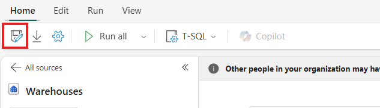

15. Enter the text** products_by_suppliers_notebook**. Ensure you set
    the location to your Workspace. Select the **Save** button to save
    the notebook.

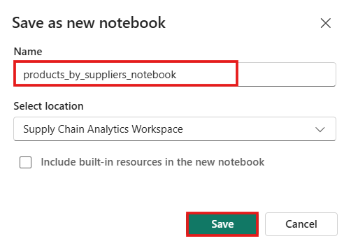

## Exercise 8 – Setup and Configure the GraphQL API

To create the API for GraphQL that you'll use for an application:

1.  Open the tutorial database portal.
    Select the **New** button and select **API for GraphQL**.

2.  Enter the
    text **supplier_impact_gql** for the **Name** for your item and
    select **Create**.

3.  Select **data source** card displayed
    to add the data for GraphQL.

4.  In the **Choose connectivity**
    option, you can select **Connect to fabric data sources with single
    sign-on (SSO) authentication** option and click on OK.

5.  On the **Choose the data you want to
    connect** page, Select the database
    **supply_chain_analytics_database** and click on Connect.

6.  You are presented with a **Choose Data** panel. Scroll until you
    find ***SupplyChain.vProductsBySuppliers***, the [view you created
    earlier in this
    tutorial](https://learn.microsoft.com/en-us/fabric/database/sql/tutorial-query-database).
    Select it and click on **Load** button.

7.  In the Query1 panel, replace the text you see there with the
    following GraphQL query string:

> query { vProductsbySuppliers(filter: { SupplierLocationID: { eq: 7 }
> }) { items { CompanyName SupplierLocationID ProductCount } } }
>
> Select the Run button in the Query1 window. The results of the GraphQL
> query are returned to the Results window in JSON format.

8.  Select the **Copy**
    **endpoint** button in the ribbon.

9.  Select the **Copy button** when the Copy link panel appears. Store
    this string in a notepad or other location to be used in the sample
    application for this tutorial.

**Your API for GraphQL is now ready to accept connections and
requests. **

## Conclusion

In summary, this tutorial offers a hands-on introduction to using SQL
within Microsoft Fabric. It guides you through creating and querying
databases, ingesting sample data, and performing data analysis using
T-SQL and Fabric Notebooks. By exploring practical examples, you gain
foundational skills to manage and analyze data effectively in the Fabric
environment.
